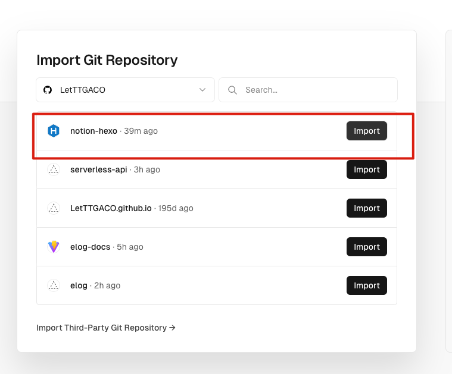
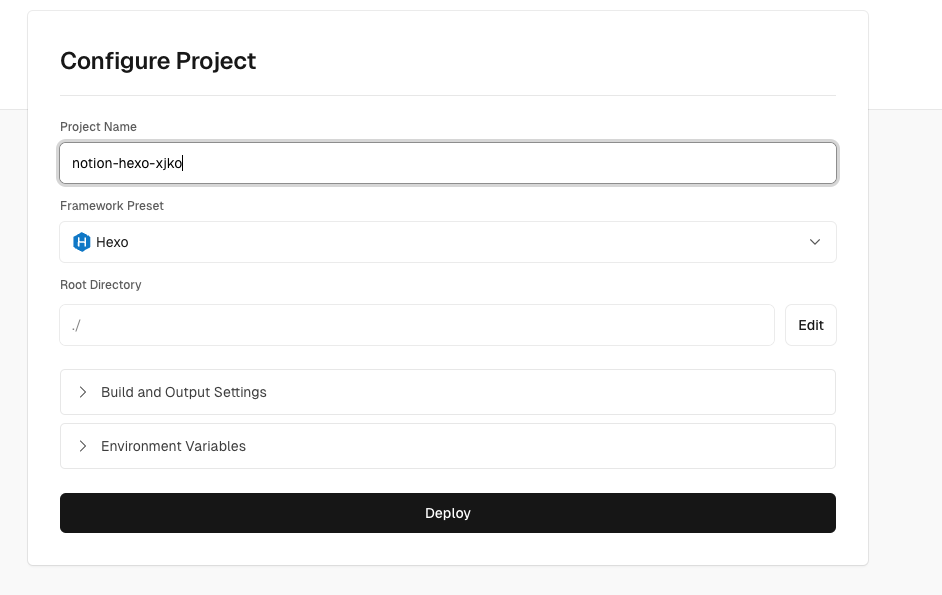
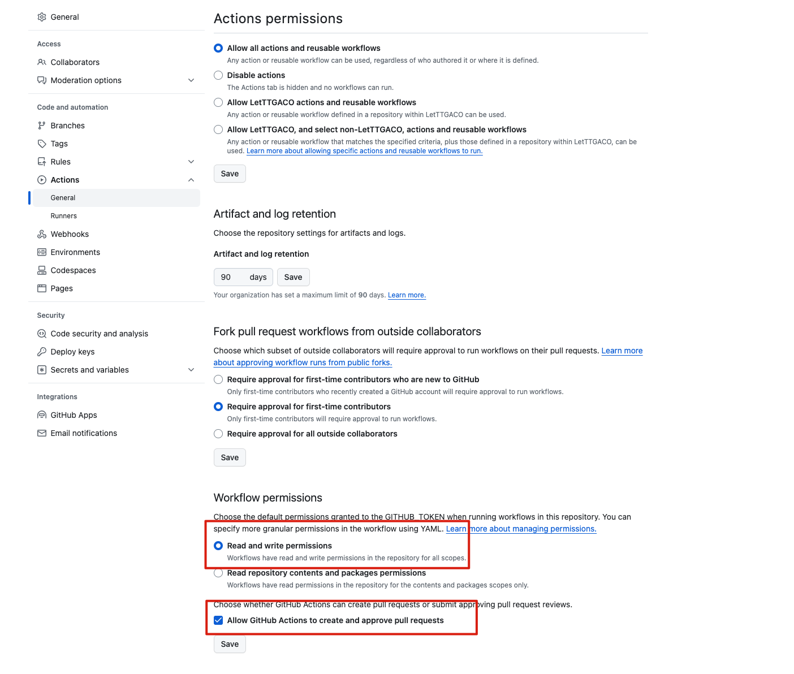
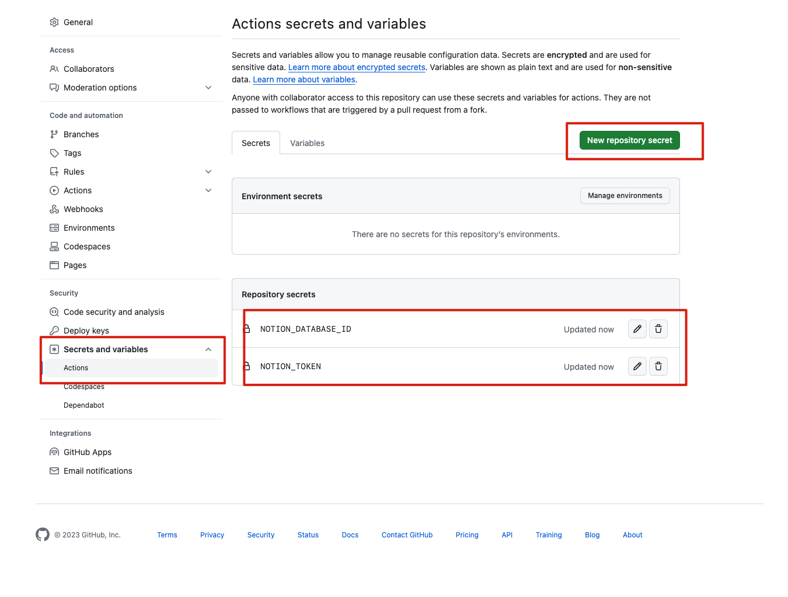

# 博客工具

- 写作平台：Notion
- 博客平台：[Hexo](https://hexo.io/)
- 博客主题：[Butterfly@4.10.0](https://github.com/jerryc127/hexo-theme-butterfly)
- 博客文档同步：[Elog](https://github.com/LetTTGACO/elog)
- 部署平台：Vercel
- 博客仓库：[https://github.com/LetTTGACO/notion-hexo](https://github.com/LetTTGACO/notion-hexo)

# 博客搭建指南


## Fork模板仓库


[点击 Fork](https://github.com/elog-x/notion-hexo/fork) 该模板仓库到个人 Github 账号仓库下并 clone 到本地


## 安装依赖


在项目根目录下运行命令安装依赖


```shell
npm install
```


## 新建 Elog 本地调试文件


在项目根目录中复制`.elog.example.env`文件并改名为`.elog.env`，此文件将用于本地同步Notion 文档


## 配置 Notion 关键信息


按照[文档提示](https://elog.1874.cool/notion/gvnxobqogetukays#notion)配置 Notion 并获取 `token` 和 `databaseId`，在本地`.elog.env`中写入


```plain text
NOTION_TOKEN=获取的token
NOTION_DATABASE_ID=获取的databaseId
```


## 本地调试


在项目根目录运行同步命令


```shell
npm run sync:local
```


## 启动 Hexo


在项目根目录运行hexo启动命令，会自动打开本地博客


```shell
npm run server
```


## 配置 Hexo 博客


根据 [Hexo](https://hexo.io/) 文档和 [Butterfly](https://github.com/jerryc127/hexo-theme-butterfly) 主题配置文档，配置你的博客直到你满意为主，你也可以换别的主题，这里不做演示


## 提交代码到 github


本地访问没问题直接提交所有文件到 Github 仓库即可


## 部署到 Vercel


注册 Vercel 账号并绑定 Github，在 Vercel 导入 该项目，Vercel 会自动识别出该 Hexo 项目，不需要改动，直接选择 Deploy 部署。部署完成会有一个 Vercel 临时域名，你也可以绑定自己的域名。








## 配置 Github Actions 权限


在 Github 仓库的设置中找到 `Actions-General`，打开流水线写入权限`Workflow permissions`





## 配置环境变量


在本地运行时，用的是`.elog.env`文件中定义的 Notion 账号信息，而在 Github Actions 时，需要提前配置环境变量。


在 Github 仓库的设置中找到 `Secrets  and variables`，新增仓库的环境变量`NOTION_DATABASE_ID`和`NOTION_TOKEN`和`.elog.env`保持一致即可





## 自动化部署


当在 Notion 中改动文档后，手动/自动触发 Github Actions流水线，会重新从 Notion 增量拉取文档，自动提交代码到 Github 仓库。


Vercel 会实时监测仓库代码，当有新的提交时都会重新部署博客。如此就实现了自动化部署博客。


整个流程的关键点就在于：如何手动/自动触发 Github Actions


在项目.`github/workflows/sync.yaml`中已经配置了外部 API 触发 Github Actions 事件，所以只需要调用 API 触发流水线即可。


### 手动触发


为了方便，这里提供一个部署在 Vercel 的免费公用的[**ServerlessAPI**](https://github.com/elog-x/serverless-api)，只需要配置好 URL 参数并浏览器访问即可触发流水线


```shell
https://serverless-api-elog.vercel.app/api/github?user=xxx&repo=xxx&event_type=deploy&token=xxx
```


### 自动触发


可在 Notion 中结合 Slack 触发，[参考教程](https://elog.1874.cool/notion/vy55q9xwlqlsfrvk)，这里就不做进一步演示了


# 自定义 Elog 配置


如果想自定义 Elog 配置，可访问 [Elog 文档](https://elog.1874.cool/)


# 博客示例


示例仓库：[https://github.com/LetTTGACO/notion-hexo](https://github.com/LetTTGACO/notion-hexo)


博客示例地址：[https://notion-hexo.vercel.app](https://notion-hexo.vercel.app/)

