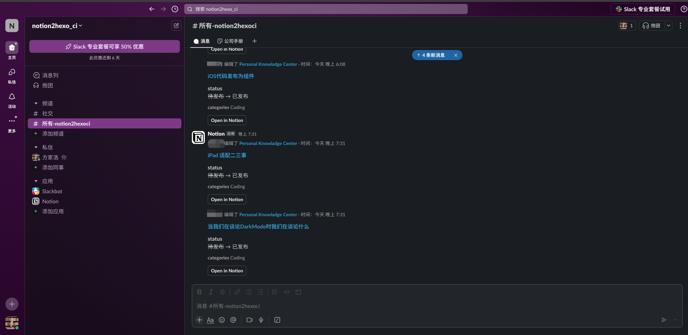

# 创作&开发


## Notion

- 使用 notion 进行内容创作
- 使用 notion database 进行知识库整理

    本文使用 hexo 平台，可参考[**elog-hexo-template**](https://1874.notion.site/867486af567f4a8897427b15ffd10b3c?v=a25aec8e27d5415e8605e43034f822bd) 创建数据库副本或增加必要属性到已有 Notion 数据库


    


## Hexo

> 使用 Hexo 进行博客开发
- 使用git分支保存源码

    因Github Page要求使用master分支作为发布网站的源代码，我们只能用master分支来保存hexo生成的静态网页，对于博客源码，可以新建一个source分支来存储。在github上打开Pages对应的仓库，也就是以”[username.github.io](http://username.github.io/)”命名的仓库，然后建立一个source分支，仓库的默认分支改为保存源码的source分支，这样通过`git clone`拉取的就是source分支代码了。

- 根据自己喜好配置 Hexo

    这里可以自行搜索，也可以参考《Hexo 相关记录》一文

- 仓库源码大致目录结构如下

    ```yaml
    .
    ├── README.md
    ├── _config.landscape.yml
    ├── _config.next.yml
    ├── _config.yml
    ├── db.json
    ├── elog.cache.json
    ├── elog.config.js
    ├── hexo.sh
    ├── node_modules
    ├── package-lock.json
    ├── package.json
    ├── public
    ├── scaffolds
    ├── source
    ├── themes
    └── time.txt
    ```


# CI/CD

> 本项目持续集成的路径为：notion ⇒ slack ⇒ pipedream ⇒ elog + github action 

## Slack

1. 注册 [Slack]([https://slack.com/](https://slack.com/))

注册完成后创建工作区


    

1. 创建频道（channel）

    

2. 添加应用 Notion

    

3. 全部创建完成后如图

    


## Notion

1. 创建 automation，设置触发器

    在数据库页面点击闪电按钮，可以创建 `automation` ，增加触发器以及执行器


    


    根据自己喜好设置触发器，设置完成后如下


    


## Pipedream

1. 注册
2. 创建 Project

    

3. 创建 workflow

    在 project 下创建workflow


    

4. 设置 workflow

设置 workflow，触发器选择 Slack，选择`New Message In Channels` ，按照如下设置


    


    

1. 增加 Python step

    增加一个 Python Step，代码如下所示


    


    ```python
    import os
    import requests
    import json
    
    
    def handler(pd: "pidedream"):
        try:
    
            token = os.environ['GITHUB_TOKEN']
            user = "github_username"
            repo = "github_repo"
            event_type = "deploy"
            headers = {
                "User-Agent": "@elog/serverless-api",
                "Accept": '*/*',
                "Authorization": f"token {token}",
            }
            response = requests.post(
                f"https://api.github.com/repos/{user}/{repo}/dispatches",
                headers=headers,
                data=json.dumps({"event_type": event_type})
            )
            # response.raise_for_status()
            print(response.text, response.json())
            return {"message": response.json() or 'Success!'}
        except Exception as e:
            print(e)
    ```

2. 设置完成后如图所示

    

3. 配置环境变量，用于 code 中使用，在环境中通过 `os.environ['your_token']`来使用

    


## Elog + Github Action

1. 在博客文件夹根目录配置 Elog

    参考[官方文档]([https://elog.1874.cool/notion/start](https://elog.1874.cool/notion/start))进行操作，其余相关配置以官方文档为准。

2. 项目添加 workflow 配置

    在项目文件夹根目录增加 github actions 相关配置文件`.github/workflows/`**`main.yaml`** 


    ```yaml
    name: Deploy To Github Pages
    
    on:
      # 允许手动push触发
      push:
        branches:
        # 存放源码的分支
          - master
      # 允许外部仓库事件触发
      repository_dispatch:
        types:
      # api中的event_type就是这个
          - deploy
    
    jobs:
      build:
        runs-on: ubuntu-latest
    
        steps:
          - name: 检查分支
            uses: actions/checkout@master
    
          - name: 安装node环境
            uses: actions/setup-node@master
            with:
              node-version: "16.x"
    
          - name: 安装依赖
            run: |
              export TZ='Asia/Shanghai'
              npm install --prod
    
          - name: 拉取语雀/Notion的文章
            env:
              # 语雀相关环境变量
              YUQUE_TOKEN: ${{ secrets.YUQUE_TOKEN }}
              YUQUE_LOGIN: ${{ secrets.YUQUE_LOGIN }}
              YUQUE_REPO: ${{ secrets.YUQUE_REPO }}
              # Notion相关环境变量
              NOTION_TOKEN: ${{ secrets.NOTION_TOKEN }}
              NOTION_DATABASE_ID: ${{ secrets.NOTION_DATABASE_ID }}
              # 图床相关环境变量，以腾讯云COS为例
              COS_SECRET_ID: ${{ secrets.COS_SECRET_ID }}
              COS_SECRET_KEY: ${{ secrets.COS_SECRET_KEY }}
              COS_IMAGE_BUCKET: ${{ secrets.COS_IMAGE_BUCKET }}
              COS_IMAGE_REGION: ${{ secrets.COS_IMAGE_REGION }}
            run: |
              # 对应package.json中的script.sync
              npm run sync
    
          - name: 配置Git用户名邮箱
            run: |
              git config --global user.name "xxx"
              git config --global user.email "xxx@xx.com"
    
          - name: 提交yuque拉取的文章到GitHub仓库
            run: |
              echo `date +"%Y-%m-%d %H:%M:%S"` begin > time.txt
              git add .
              git commit -m "更新文档" -a
    
          - name: 推送文章到仓库
            uses: ad-m/github-push-action@master
            with:
              github_token: ${{ secrets.GITHUB_TOKEN }}
    
          - name: 生成静态文件
            run: |
              # 对应package.json中的script.build
              npm run build
              
          
          - name: 部署到Github Pages
            uses: peaceiris/actions-gh-pages@v4
            with:
    	        # 这里使用 github token
              personal_token: ${{ secrets.GITHUB_TOKEN }}
              # hexo 设置为这个路径
              publish_dir: ./public
              external_repository: JiaHaoFang/JiaHaoFang.github.io
              # 存放 github page 静态文件的分支
              publish_branch: master
              commit_message: ${{ github.event.head_commit.message }}
    ```

3. 添加环境变量

    根据 Elog 文档获取对应的环境变量，添加到 github 仓库设置


    

4. 配置Actions 执行权限

    在仓库的 Settings-Actions-Genaral-Workflow permissions 中配置执行权限


    

5. Github Page 设置

    设置 Github Page 的部署分支（区分与源代码分支），这里本人使用 master 部署静态页面，使用 source 分支存放源码


    


## 执行效果

- Slack

    

- pipedream


- Github Actions

    


    

