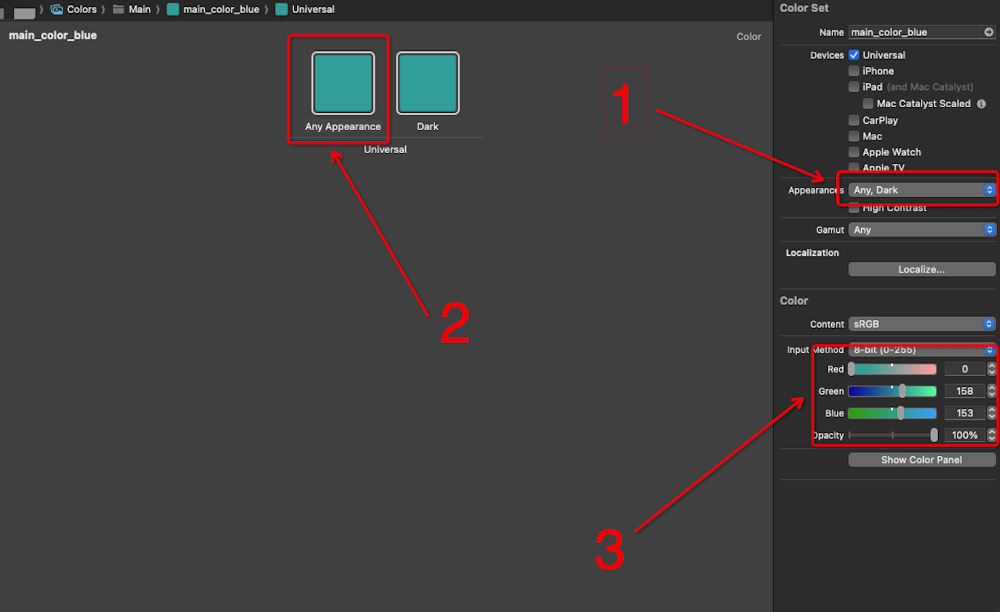
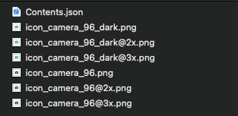
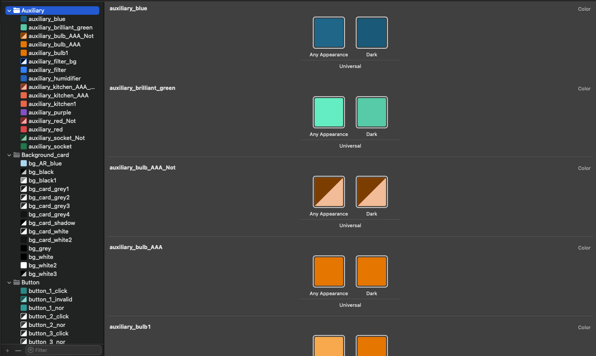
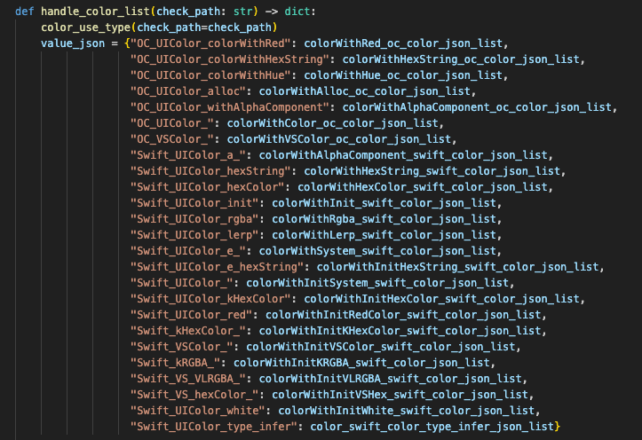

> 本文已发表在微信公众号，[《当我们在谈论DarkMode时我们在谈论什么》](https://mp.weixin.qq.com/s/GolsykOfKmhaloVTjoZk3g)

# 前言


2024年6月，Apple 在 WWDC2024 发布了iOS18。新版本的 iOS 系统中包含了一项褒贬不一的新特性：把深色模式扩展到了主屏幕的图标，这让已经融入我们生活中的深色模式功能多多少少又秀了一把存在感。


距离 iOS13 深色模式功能上线已经过去五年了，市面上常见的手机应用绝大部分也适配了深色模式，笔者个人更是对这一功能情有独钟，将其视为 App 中并非最重要，但不可或缺的功能之一。同时作为一个 iOS 开发者，笔者也十分清楚对于一个功能完整，已经运营了一段时间的 App 要适配这一功能需要付出怎么样的努力，这篇文章不只是对深色模式适配的介绍，也是对 VeSync App 完整适配过程的分享。


# 原理


在进行适配之前，肯定要先了解Apple 给出的相关API。本篇文章的重点其实并不是介绍这些[官网](https://developer.apple.com/documentation/uikit/appearance_customization/supporting_dark_mode_in_your_interface)白纸黑字写清楚的东西，但是出于文章完整性的考虑，这部分内容还是必不可少的。


注意：下文介绍的内容均默认 App 的最低支持版本为 iOS13，省略了版本判断的相关代码。


## API

- UIView 的 overrideUserInterfaceStyle 属性

获取当前window之后，修改window的overrideUserInterfaceStyle属性，页面的颜色/图标会根据设置的模式同步更新，不需要手动操作。


```plain text
guard let windowScene = UIApplication.shared.connectedScenes.first as? UIWindowScene, let window = windowScene.windows.first else { return }
// 设置为Light模式
window.overrideUserInterfaceStyle = .light

public enum UIUserInterfaceStyle : Int {
    // 未指明的
    case unspecified
    // 浅色模式
    case light
    // 深色模式
    case dark
}
```

- 获取当前深色模式状态

```plain text
/// 在 UIView 中
let mode = self.traitCollection.userInterfaceStyle
/// 不在 UIView 中
let mode = UITraitCollection.current.userInterfaceStyle
```

- 监听深色模式切换

```plain text
override func traitCollectionDidChange(_ previousTraitCollection: UITraitCollection?) {
    if UITraitCollection.current.userInterfaceStyle == .dark {
        // Do something
    } else {
        // Do something else
    }
}
```

- 某个页面单独设置不支持深色模式

```plain text
extension ViewController {
    override func viewWillAppear(_ animated: Bool) {
        super.viewWillAppear(animated)
        self.overrideUserInterfaceStyle = .light
    }
}
```


## 颜色资源支持


系统提供了一种创建自定义颜色的方法


```plain text
// 创建自定义颜色的方法
public init(dynamicProvider: @escaping (UITraitCollection) -> UIColor)

// 通过当前traitCollection得到对应UIColor
open func resolvedColor(with traitCollection: UITraitCollection) -> UIColor
```


或者在assets 中直接添加颜色资源，如下图




1. 修改 Appearance 为 Any,Dark；
2. 点击选中浅色/深色模式下的颜色；
3. 编辑色值

## 图片资源支持


1. 修改 Appearance 为 Any,Dark；
2. 把深色模式的资源拖到对应位置；

## 其他需要注意的地方

1. CGColor 不支持动态更新颜色，原因是 CoreGraphic 是比 UIKit 更底层的库，动态更新颜色是 UIKit 支持的功能，cgColor 只会使用一开始设置的颜色色值（`xxx.cgColor = UIColor.systemBackground.cgColor`），并不会跟着系统的外观切换而动态更新色值。
2. 在iOS系统切换模式之后，会调用`layoutSubviews`方法，也可以在这个方法里做UI更新
3. 使用 UIGraphics 绘制的图片，可以分别绘制亮色和暗色的图片，再通过`UIImage.imageAsset`注册，让其能够自动切换外观

# 中场休息


以上是深色模式相关的所有内容，你已经学会了，现在来试试看吧！


开个玩笑～


从上面的官方接口说明中看出，深色模式的适配分为图片资源和颜色资源两个板块，如果你的 App 从一开始就使用官方的资源管理方案进行图片和颜色资源的管理，那恭喜你，你们的适配将会非常轻松，你们只需要导出图片和颜色的资源，让设计师在原有资源名字下提供深色模式的图片和颜色，比如XXX_dark，这样我们就可以通过脚本将图片和颜色资源导入资源管理库，即可完成深色模式适配的绝大部分工作。


实际上，理论与实践总是存在着巨大差异，接下来让我们一起看看 VeSync 在深色模式适配的实践中到底是怎么做的。


# 图片资源处理


VeSync App的图片资源，绝大多数都是使用的系统资源管理库进行管理，所以我们使用标准的处理方案进行处理即可。


## 方案


上文已经提过，只要在 assets 中管理的图片资源添加对应的深色模式的图片，系统就会在外观切换的时候自动切换图片的样式。按照VeSync 的图片资源命名规范，一张图片的深色样式是在原有图片名加上”_dark”或者”Dark”后缀，这取决于图片原本的命名方式是下划线还是驼峰，最终效果如：





但是上面只是理想情况，实际上我们还遇到了下面的问题：

1. 由于新的 UI 图片采用了统一的命名规范，导致旧版图片无法直接通过文件名匹配批量处理；
2. UI 设计师会要求在新增深色样式图片的同时，更新浅色样式的图片；
3. 早期项目中相同图片被反复添加，形成了冗余资源，这些重复图片需要去重处理。

以上这些问题我们都使用了脚本进行辅助处理。


## 实施


辅助脚本的整个流程基于图片相似度计算、脚本自动化处理与人工补充相结合。每一步的中间结果（如未匹配图片、重复图片等）都会生成 Excel 文件，以便人工确认和后续处理。


因为 App 的图片资源已经抽离在系统文件资源库中，对图片资源的更新不会影响到业务代码，所以这一部分工作由专人负责，负责整个 App 的所有图片的补充、替换、去重工作。工作流的大致流程图下图所示：


我帮您检查了全文，发现以下需要注意的地方：


```mermaid
graph TB
A[自动匹配与配置更新] ---> B[人工补充未匹配图片]
B ---> C[扫描查找重复图片]
C ---> D[删除重复图片并更新项目引用]
```

1. 图片相似度匹配

    使用脚本计算浅色模式图片的相似度，找到与暗色模式图片匹配的目标路径。将匹配成功的暗黑模式图片复制到目标文件夹，同时修改目标文件夹中的 Contents.json，为每张图片添加暗色模式配置。


    这一步完成之后，大部分浅色模式图片能够匹配到对应的暗黑模式图片并完成更新。（因尺寸、色彩空间、内容轻微差异等问题）未匹配到的图片会被记录到一个 Excel 文件中，供后续人工处理。


    注：这一步使用 OpenCV 提供的模板匹配（Template Matching）方法进行图像相似度计算以建立新旧图片之间的关系。

2. 人工补充未匹配图片目标，补充第一步中未能自动匹配的图片。

    在第一步生成的 Excel 表格人工填写未匹配图片对应的暗黑模式图片路径，将补充完成的表格作为输入，使用脚本批量将这些图片添加到目标路径，并更新 Contents.json，为所有浅色模式图片都具备对应的暗黑模式版本。

3. 扫描查找重复图片，清理项目中存在的重复图片。

    使用脚本扫描项目文件，定位所有重复的暗黑模式图片。将重复的图片记录到一个 Excel 文件中，供后续人工校对。

4. 删除重复图片并更新项目中引用的图片名称。

    人工校对第三步生成的重复图片 Excel 表格，确认需要删除的图片。此后遍历项目中所有代码源文件，查找并替换引用的旧图片路径为新图片的路径。


## 其他图片资源


除了 assets 中的图片资源，我们还有两种资源：

1. 本地图片资源：一些使用不规范的图片资源没有使用 assets 管理，而是直接把资源添加到工程文件夹目录，导致了这些资源无法根据系统外观自动切换。一种处理方案是在资源使用处手动添加两个版本的图片资源使其自动切换（`UIImage.imageAsset`的方式），更优的方案是将这些资源迁移到 assets 中统一管理。
2. 网络图片资源：对于 url 资源，我们无法做到动态切换。这常见于一些用户自定义的图片、头像等，也有一些配置化的资源需要存在云端，在使用的时候才会拉取下来进行展示。对于这种情况，在我们与设计团队进行沟通之后，决定对于这些资源进行统一化处理，即在深色模式和浅色模式下都用同一张图片资源，这样就免去了动态切换的麻烦。在进行统一化处理的时候，需要注意图片的背景颜色、图片透明度的问题，同时如果需要在不同外观下具有不同的背景色，则背景色应该交由 App 进行绘制，再将图片叠加其上。

此外，除了单纯的图片资源，我们还有动画资源。

1. JSON 动画资源：目前我们团队采用的动画方案是 Lottie + JSON，显而易见地，这种方案并不支持在系统层面上根据外观自动切换。我们采用的方案是手动监听系统的外观模式切换，根据系统的外观更新对应的 JSON 以达成动画的深色模式或浅色模式更新。在处理一些与当前状态相关的动画效果的时候，需要注意动画切换时的流畅性。
2. GIF 动画资源：在一些老旧的业务代码中还存留着 GIF 动画资源。与 JSON 动画类似，我们需要监听系统的外观切换，手动更新动画。

# 颜色资源处理


根据官方指南，相较于以前的硬编码颜色色值的使用方式，支持深色模式的资源更适合使用语义化的名称，根据颜色的使用场景为其命名，配置好的颜色资源会自动适应当前的 App 外观。


在支持深色模式的场景下，颜色应该使用“颜色的场景名称”而不是“颜色的色值”。在这种定义推动下，我们“只需要”工程里用到的所有的颜色色值替换成语义化颜色名即可。


对于一个持续运营迭代了好几年的 App，这样子的颜色色值替换可不是简单的工作。在一个体量并不小的工程中，找出所有的颜色色值并替换会遇到下面这些问题：

1. Swift/OC创建颜色的方法有很多种，对于这些五花八门的颜色使用方式，我们要怎么找到它们然后再一一替换成需要的资源？
2. 对于海量的颜色色值，我们势必采用批量处理的方式进行替换，如果仅使用 IDE 的 Find-Replace 方式进行替换效率太低，要如何提升效率并保证准确率？
3. 对于各种各样的业务及所用到的颜色色值，要怎么定义它们的一一对应关系？换句话说，原本的么处理？
4. 对于 VeSync 来说，业务形态决定了某一些板块会相对独立，在开发者对某一模块并不熟悉的情况下要怎么进行这一部分的适配工作？

显然，量变产生质变，要人工逐个替换已经是不可能完成的工作了，通过`脚本`进行颜色替换就是自然而然选择了。以下就介绍一下颜色处理的方案和实践流程。


### 方案


在脚本替换之前，我们需要先建立我们的颜色资源库。


根据官方指南， 我们需要一个语义化的颜色资源库。这一部分工作由设计部门完成，他们需要为 App 内所用到的所有颜色色值增加对应深色模式的颜色色值，并为其命名，形成一套完整的语义化颜色资源。


在拿到语义化的颜色资源后，我们要将这些颜色资源导入到工程中。由于涉及到跨部门、跨工具的合作（Zeplin/Figma、Xcode/VSCode），这一部分并没办法用脚本处理，只能人工一个个颜色搬运到工程的 .xcassets 文件中。在辛苦搬运完成后，我们就可以使用脚本读取这些资源并使用它们了。


至此我们有了语义化的颜色资料库，那么接下来就是识别工程中的存量的硬编码的颜色代码，并进行替换了。虽然先前的问题中提到了硬编码色值的方式多种多样，但事实上这些编码方式总是可以穷举的。既然可以穷举，那我们就可以编写脚本进行批量处理。我们采用的方式是通过遍历源文件，以正则匹配的方式获取到硬编码色值的代码段及其对应的色值。


当有了颜色资料库、有了工程所用到的颜色，下一步要做的事情已经显而易见了。我们对比两者，将原本的硬编码色值的相关代码替换为语义化的颜色名代码。此外，为了处理一些“边界情况”，我们需要使用 Excel 表格记录下我们的替换结果，让开发人员能够有所凭依地进行开发和检查。


到这里为止，我们使用脚本适配深色模式的流程就已经基本构思完成，如下流程图所示：


```mermaid
graph TB
A(人工导入语义化颜色资源) ---> B[脚本读取.xcassets中的颜色资源]
B -- 输出 --> C1(颜色代码)
B ---> D{使用色值进行比对}
D --色值不同--> D1(输出 error.xml)
E(穷举颜色编码方式) ---> F[识别、解析存量的硬编码颜色]
F ---> D
D --色值相同--> G[替换硬编码颜色为语义化颜色]
G -- 输出 --> H[工程源码替换]
G -- 输出 --> H1(记录success.xml)
H ---> I(替换完成，结束)
```


### 实施


接下来我们简单介绍一下具体的实践方式。


iOS 使用 .xcassets 的方式储存颜色资源，配置好的颜色资源如下图所示：





这一个个颜色资源本质上是`Contents.json`文件：


```plain text
{
  "colors" : [
    {
      "color" : {
        "color-space" : "srgb",
        "components" : {
          "alpha" : "1.000",
          "blue" : "0x89",
          "green" : "0x66",
          "red" : "0x00"
        }
      },
      "idiom" : "universal"
    },
    {
      "appearances" : [
        {
          "appearance" : "luminosity",
          "value" : "dark"
        }
      ],
      "color" : {
        "color-space" : "srgb",
        "components" : {
          "alpha" : "1.000",
          "blue" : "0x77",
          "green" : "0x59",
          "red" : "0x02"
        }
      },
      "idiom" : "universal"
    }
  ],
  "info" : {
    "author" : "xcode",
    "version" : 1
  }
}
```


通过解析 json 中的`components`我们可以得到颜色名和色值的对应关系。需要注意的是，`components`中的色值可能存在不同的写法，这与xcassets文件中颜色的 `Input Method`有关。


在读取完语义化颜色后，我们会把这些资源输出为一个单独的模块。在这一步我们使用了一些模板代码，将解析到的语义化颜色名及其色值按照 swift 规范整理成我们需要的方法及其注释，如下所示，以便在业务代码中引用。


这些颜色读取的脚本和模板代码应该单独抽离出来或生成一个可执行文件，为后续项目的开发新增颜色创造便利条件。


```plain text
@objc public class VSColor: NSObject {}
/// 语义化颜色
public extension VSColor {
    // MARK: - Auxiliary
    /// Light - 006689, 1.00
    /// Dark - 025977, 1.00
    @objc static func auxiliary_blue() -> UIColor {
        return color(named: "auxiliary_blue")
    }
    /// Light - 64EDC2, 1.00
    /// Dark - 57CBA7, 1.00
    @objc static func auxiliary_brilliant_green() -> UIColor {
        return color(named: "auxiliary_brilliant_green")
    }
    // ...
}
```


类似地，我们采用脚本读取工程中存量的硬编码颜色。对于各种各样的颜色编码方式，我们只能采用”比较笨”的穷举的方式，找到工程中使用的编码方式，采用字符串分割或者是正则匹配的方式提取到这一段代码块并解析色值，具体问题具体分析。这一步其实就是“玩转字符串”，相信大家一定很熟悉，笔者就不在这里献丑了。


事实上这一步需要处理的细节会想象中的更多，比如处理 swift、OC 的语法区别（没错，还有 OC 代码）；比如 RGBA 和 HEX 的写法需要区分和解析；比如处理浅色模式的同一个色值在深色模式下可能会有不同的色值，即同一个硬编码色值在不同的业务板块需要替换成不同的语义化颜色。


此外，我们除了需要记录提取到的代码块的源码、解析到的rgba值之外，还需要额外记录代码的文件位置和行数等有用信息，以便后续进行字符串替换。


放一个图让大家看看“穷举”到底有多少





接下来要做的事情就比较简单了，遍历两个数组（硬编码颜色、语义化颜色），使用他们的 rgba 值进行比对，如果硬编码颜色匹配到了对应的语义化的颜色名，则直接在源码中进行文件读写操作，替换为语义化颜色名，同时记录到 Excel 文件中。下面是这个功能的伪代码：


```plain text
Read color resources into vscolor_json
Identify and parse hardcoded colors into color_json

For each sheet in color_json
    For each line in sheet
        If line contains "red value", "green value", "blue value", "alpha value", and "result" is "correct"
            For each vscolor in vscolor_json
                If line's color values match vscolor's color values
                    Get file_path, line_number, old_color
                    Determine new_color based on sheet type
                    Print replacement information
                    Replace color code in file
                    Exit loop
          Else
              Continue to next loop
```


写到这里，脚本的任务基本就完成了，这些脚本为我们提取并替换颜色，大幅度提高了工作效率，为程序员的头发作出了巨大贡献。


### 机器队VS人工队


VeSync App 是使用组件化的方式进行业务开发，在一个组件内的业务代码相对完整，他们的开发者对自己负责过的业务组件更加熟悉，但考虑到实际情况，这些开发者并没有很多时间投入到存量业务的深色模式适配项目中。面对这个问题，我们采用了**脚本替换+人工校对+UI阶段性验收**的方式进行项目开发，具体的开发流程如下


```mermaid
sequenceDiagram
    autonumber
    participant UI as UI
    participant Dev as App开发-负责人
    participant Bus as App开发-业务线

    UI->>Dev: 按模块出设计稿
    Note right of Dev: 开始开发流程
    Dev->>Bus: 协调模块对应开发人员
    Bus->>Dev: 业务线提前告知介入时间
    Dev->>Dev: 1. 申请Zeplin/Figma权限<br>2. 申请相关开发仓库分支<br>3. 执行颜色替换脚本<br>4. 大致修正颜色
    Dev->>Bus: 业务线实际介入开发
    Note right of Bus: 业务线进行校对&开发工作
    Bus->>Dev: 开发完成，返回开发负责人
    Dev->>Dev: 代码合并、打包
    Note right of Dev: 开发完成，准备审查
    Dev->>UI: 阶段性审查
    UI->>Dev: UI问题修正
    Note right of UI: 根据审查结果进行调整
    Dev->>UI: 最终审查
    Note right of UI: 确认无误，流程结束
```


对于上图的流程这里再做一些补充说明：

- App 开发-负责人：
- 申请分支：负责人会与业务线开发人员沟通，申请对应业务相关的仓库分支
- 执行脚本：在申请完分支以后，负责人会执行脚本，替换大部分颜色，保证各页面基本适配
- 大致修正颜色：对于一些特殊颜色，开发负责人会在业务线介入之前大致修正白色的使用（根据颜色的使用语境判断）
- App 开发-业务线
- 前告知介入时间：在介入的提前两天与负责人沟通
- 实际开发：对模块的每个页面逐个核对，修正遗漏掉的颜色等错误展示效果

按照上面的流程，深色模式的适配对于业务线的开发者来说，只需要如常执行他们的业务流程，指出并修复个别错误展示效果（颜色或图片），而工作量最大的颜色替换部分则由项目负责人使用脚本进行处理。在一个板块的适配完成后，会打包交付 UI、产品阶段性验收，验收完成后，开发再针对提出的 UI 问题进行修改。这样一来，我们就同时保证了开发的效率和准确率。


# 尾声


在探讨了深色模式的技术细节之后，我们不难发现，尽管其核心概念和实现方法在技术层面上并不复杂，但真正要将深色模式完美融入我们的应用中，却远非易事。对于已经上线并拥有一定用户基础的应用来说，如何在不破坏现有功能和用户体验的前提下，平滑过渡到深色模式，是一个需要精心策划和逐步实施的过程。虽然技术实现本身并不复杂，但要真正做到完美适配，却需要我们投入更多的精力和智慧。在未来，随着用户对个性化和舒适度要求的不断提高，深色模式无疑将成为应用中不可或缺的一部分。我们期待，通过不断的探索和实践，能够为用户带来更加丰富和舒适的使用体验。


感谢您的阅读，希望本文能够为您提供一些关于深色模式适配的有益见解和启发。如果您有任何疑问或建议，欢迎留言交流。

