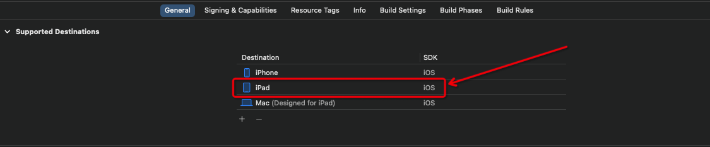
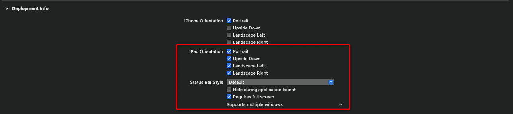
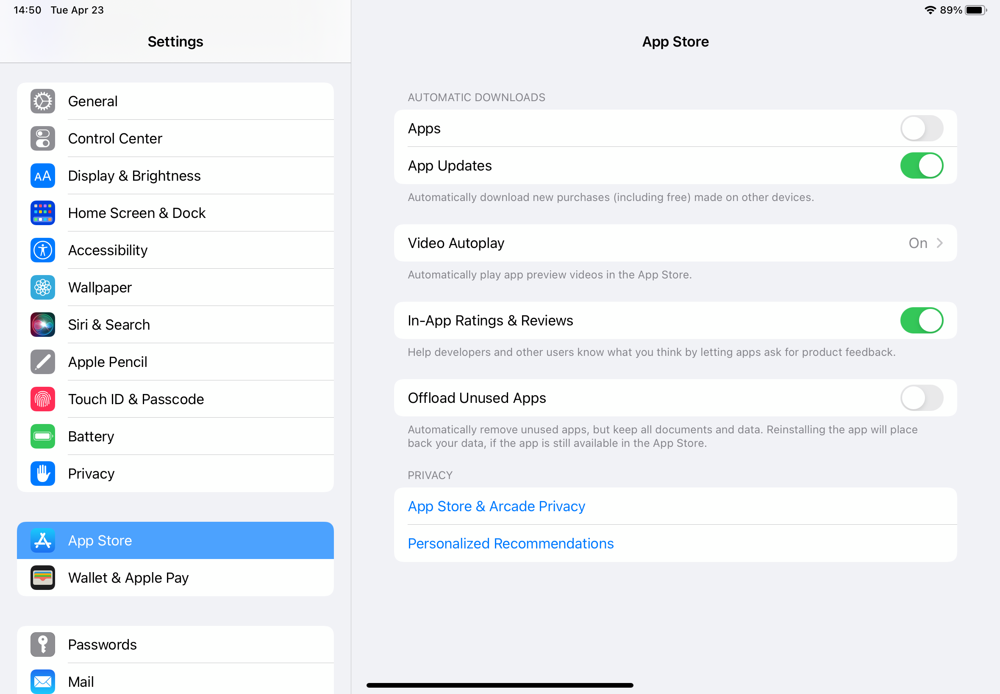
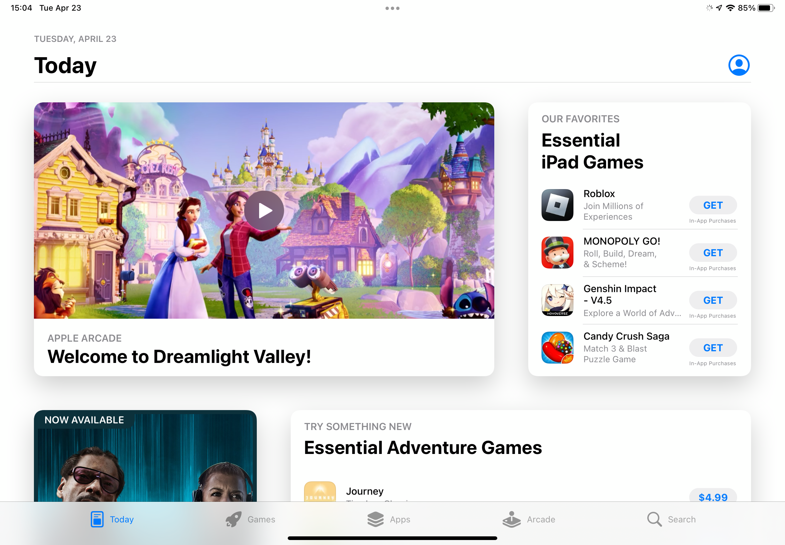
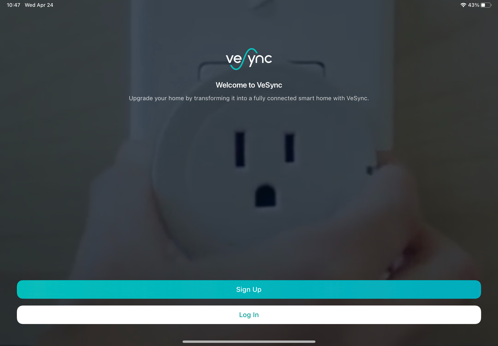
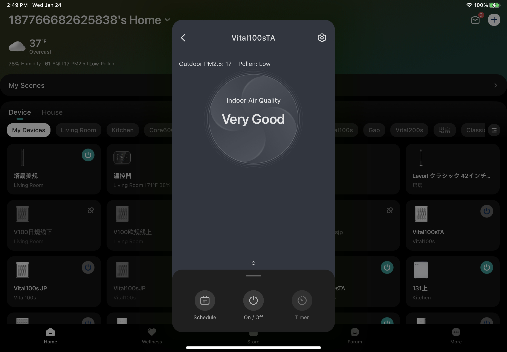

> 本文已发表在微信公众号，[《iPad 适配二三事》](https://mp.weixin.qq.com/s/mbZzBNYlzku2vn4ElUspXA)

# **背景&前言**


当谈及移动设备的应用程序开发时，iPad是一个备受关注的平台。作为一款功能强大且备受欢迎的设备，iPad是许多人日常生活中不可或缺的工具之一。对于开发者来说，确保他们的应用在iPad上的完美适配是至关重要的。


然而，大部分公司都会选择优先开发和推广手机端 app 的发展策略，前期不会花费过多精力在iPad 端进行适配，在 app 有了一定体量之后，用户对 iPad 端的体验提出需求之后，才会开始考虑进行 iPad 的适配。这就势必造成 iPad 的适配必须要考虑原有业务代码对适配工作造成的影响——这并不是一个简单的任务。


在本文中，我们将探讨一些iPad应用适配策略和最佳实践，介绍一些常见的适配问题，并提供解决方案和建议，帮助开发人员克服这些障碍。无论您是一个经验丰富的开发人员还是一个新手，我们相信这篇文章将为您提供有关在iPad上适配应用程序的经验建议和指导。


# **技术储备**


## **工程配置**


要让原本为 iPhone 平台开发的 app 能在 iPad 上使用，第一步就是要在 target 中添加对 iPad 平台的支持，这个配置项能让 app 在 iPad 平台运行。





经常用 iPad 的朋友们都知道，一个 app 在 iPad 端的呈现方式是十分多样化的，可以有横屏竖屏分屏浮窗等样式。在实际开发中，iPad 横竖屏的支持在 `iPad Orientation` 配置项中设置；浮窗/分屏的支持由 `Requires full screen`决定，勾选了此项之后即不支持浮窗或分屏。


本文主要涉及的是 iPad 横竖屏的适配，不涉及浮窗/分屏的适配。





到这里为止，我们的应用就可以在 iPad 上跑起来了。


## 屏幕方向的定义


对于开发者来说，app 在 iPad 上和 iPhone 上运行最大的区别就是对屏幕旋转的处理，绝大多数应用在手机上都是固定一个方向，但是在 iPad 上则需要支持多个方向的展示。另外在实际项目中，可能有一些场景，比如视频播放，需要强制应用变成横屏/竖屏，这需要我们在代码里做特殊处理。


要处理屏幕旋转，首先我们要知道屏幕方向是怎么定义的。在 UIKit 中， 屏幕方向一般使用`UIApplication.shared.statusBarOrientation`进行判断。它的定义如下：


```swift
public enum UIInterfaceOrientation : Int, @unchecked Sendable {
    case unknown = 0
    case portrait = 1
    case portraitUpsideDown = 2
    case landscapeLeft = 4
    case landscapeRight = 3
}
```


要注意的是，有另外一个易混用的方向：`UIDevice.current.orientation`。这个变量的含义是设备的方向，为`UIDeviceOrientation`类型，包含有`FaceUp`、`FaceDown`的信息，但我们只想要屏幕的方向（横/竖），过多的类型会影响我们的判断，**不推荐**使用这个方式。


## **设置屏幕方向**


在知道如何判断屏幕方向之后，我们就可以处理屏幕方向的旋转问题了。在开发过程中，除了 2.1 中的工程配置，常见的有两种设置方向的方式：

1. Target - General - Deployment Info - iPad Orientation即 2.1 的工程配置，这里不再重复。
2. AppDelegate

```swift
// 自定义属性, 用于控制全局旋转方向
var supportOrientation: UIInterfaceOrientationMask = isPad ? .all : .portrait

func application(_ application: UIApplication, supportedInterfaceOrientationsFor window: UIWindow?) -> UIInterfaceOrientationMask {
    return self.supportOrientation
}
```


在 AppDelegate 中有一个方法**全局**可以配置 App 的展示方向，这样设置的屏幕方向优先级会高于 Target 中设置的屏幕方向。此外，这里使用一个自定义变量来存放支持的屏幕方向的原因是，我们在特定场景下可以修改`supportOrientation`的值强制更改应用的方向。

1. UIViewController

同样地，通过在 UIViewController 中设置自己的`supportedInterfaceOrientations`，可以设置某一个 VC 支持的方向：


```swift
override var shouldAutorotate: Bool {
    return true
}
override var supportedInterfaceOrientations: UIInterfaceOrientationMask {
    return [.landscapeLeft, .landscapeRight]
}
override var preferredInterfaceOrientationForPresentation: UIInterfaceOrientation {
    return .landscapeRight
}
```


这里需要特别说明的是，上面三个设置横竖屏的方式是有**优先级顺序**的，从上到下优先级依次提高。另外在实际开发中，对于每个根控制器 (`UITabBarController` 和 `UINavigationController`)，我们都需要设置上述第三点的三个方法


## **监听屏幕旋转**


我们不只是希望能设置屏幕方向，我们还希望在屏幕旋转的时候我们的获取到这一事件的通知。比较常见的有几种方式获取横竖屏切换事件：

1. 在`UIViewController`中重写`viewWillTransition` 方法，系统在屏幕发生旋转的时候会调用该方法，我们在coordinator的闭包中即可处理业务。

```swift
override func viewWillTransition(to size: CGSize, with coordinator: UIViewControllerTransitionCoordinator) {
    super.viewWillTransition(to: size, with: coordinator)
    coordinator.animate { _ in
        // 更新UI
    }
}
```

1. 监听通知 `UIApplication.didChangeStatusBarOrientationNotification` ；在使用NotificationCenter的方式进行监听时，需要注意通知的注册和移除时机，以免造成不必要的内存泄露问题。

```swift
func setupDeviceOrientationObserver() {
    // 开启并监听系统通知
    UIDevice.current.beginGeneratingDeviceOrientationNotifications()
    NotificationCenter.default.addObserver(self, selector: #selector(onDeviceOrientationChange), name: UIApplication.didChangeStatusBarOrientationNotification, object: nil)
}

@objc func onDeviceOrientationChange() {
    let currentDeviceOrientation = UIDevice.current.orientation
    // 只处理竖屏或横屏的情况（可能出现unknow或屏幕朝上/朝下）
    guard currentDeviceOrientation.isPortrait || currentDeviceOrientation.isLandscape else {
        return
    }
}

func removeDeviceOrientationObserver() {
    NotificationCenter.default.removeObserver(self, name: UIDevice.orientationDidChangeNotification, object: nil)
    // 记得关闭使计数器-1
    UIDevice.current.endGeneratingDeviceOrientationNotifications()
}
```


另外，习惯使用 Rx 的小伙伴也可以使用 RxSwift 的方式监听：


```swift
NotificationCenter.default.rx
    .notification(UIApplication.didChangeStatusBarOrientationNotification)
    .subscribe(onNext: { [weak self] _ in
       // 重绘 UI
    })
    .disposed(by: rx.disposeBag)
```


在监听设备方向的通知时，我们需要注意上文提到过的`UIDevice.current.orientation`。相对应的，`UIDevice.current.orientation`也有类似的通知方法`UIDevice.orientationDidChangeNotification`。我们使用`UIApplication.didChangeStatusOrientationNotification`通知而不是`UIDevice.orientationDidChangeNotification`通知的原因是：

- UIDevice 的通知会在从后台进入前台时调用三次，调用次数过多且不必要；
    - UIDevice 会有多个方向的通知，比如从 faceUp 转向 faceDown 时也会发出一个通知，而这个事件我们是不需要关注的
1. 除了上述的两种获取屏幕旋转事件的方式以外， 系统在发生屏幕旋转的行为的时候，会调用这 UIView 的`layoutSubviews` 方法和 UIViewController 的 `viewWillLayoutSubviews` 方法，我们还可以在这两个方法中进行 UI 的布局和刷新。

## **在旋转时刷新 UI**


在知道了如何监听屏幕旋转之后，我们接下来要做的事情就是在屏幕旋转的时候去刷新 UI。


在 ios 开发中，常见的页面布局方式有两种，一种是使用 `frame` 的**绝对布局**，一种是使用 AutoLayout 或 Masonry、SnapKit等框架的**相对布局**（下称`AutoLayout`）。


在屏幕尺寸会变化的情况下，绝对布局的方式受影响比较大，业务方需要在屏幕尺寸发生变化的时候更新这些 frame 的值。对于某些比较简单的 frame 布局的 UI，可以使用 UIView 的 `AutoresizingMask` 属性进行适配，系统会根据设置的属性对对应的 view 进行拉伸等操作。但是在实际使用中，这种方法的表现并不尽如人意，这个设置项并不能保证你的自定义视图根据你需要的方式变化。我们推荐的方案是在`layoutSubviews`方法中进行视图的 frame 的计算和赋值，这保证了代码的简洁性和 UI 的正确性。


而正确使用`AutoLayout`的布局方式能使页面较好地适应动态变化的屏幕尺寸，且在屏幕旋转时过渡效果流畅丝滑。 在使用自动布局的时候，我们应该摒弃手动计算尺寸的方式，譬如在处理一个横向三等分的布局的时候，我们不应该使用 “父视图宽度÷3” 的方式手动计算三个子视图的宽度，而应该在`AutoLayout` 中设置子视图的左右约束、三个子视图宽度相等，如此一来，我们就不需要再为变化的屏幕尺寸做多余的工作了。


根据以上原因，笔者建议在开发/适配 iPad 时应尽量使用`AutoLayout`，在遇到难以处理的 frame 布局方式时，可以考虑将其改写为`AutoLayout`。


此外，除了布局的原因需要刷新 UI，有些系统控件控件也需要手动刷新使其正确展示，常见的有：

1. UICollectionView 需要调用 `collectionView.collectionViewLayout.invalidateLayout()`方法使其刷新 itemSize；
2. 使用 UIScrollView 实现一些多页滑动效果的页面需要重新计算`contentOffset`使其有正确的偏移量；
3. 有使用 CALayer 绘制颜色/圆角/渐变色的业务需要重新绘制 layer 使其尺寸正确。

# **落地方案**


本文前半段聊的都是专注于某一处业务细节如何处理屏幕旋转、尺寸变化，但实际上具体到业务落地还有很关键的一点是整体的适配方案，也就是页面的排版。


## **常见适配方案介绍**


### 左右分栏


iPad 原生应用程序，如信息、相册、备忘录等，绝大部分采用了左右分栏的形式（如下图所示）。这种设计形式的好处在于分栏的设计能够最大化利用 iPad 的大屏，合理地利用横屏展示更多的内容。但是这种方案对原有架构的改动较大，从 UI 样式到页面交互都会发生比较大的变动，需要开发人员单独为 iPad 编写业务代码。





### 内容响应式布局


App Store 的设计方案采用的则是内容响应式布局，根据页面的宽度和高度按照特定的规则调整布局。这种方案灵活性更佳，用户体验好， 但是对设计人员和开发人员的要求也会更高。





### 横向拉伸页面


最常见的适配方案就是横向拉伸页面，页面的元素按照原有的布局逻辑横向拉伸，与手机端的布局基本保持一致。这种方式既保证了页面布局的合理性，同时也不需要开发人员过多地为 iPad 单独编写代码，是一种相对折中的适配方案。





## **VeSync 适配方案**


VeSync App 手机端用户居多，几乎所有的页面都只考虑了手机端的展示，在适配 iPad 之前，iPad 对于我们来说只是一个屏幕稍微大点的 iPhone。此外，由于 iPad 用户占比不高，公司也暂时没有在 iPad 端大力推广 VeSync App 的计划，如果要所有业务都使用 3.1 中提及的前几种方案适配，这对于我们来说成本过高。


由于 VeSync 是一个智能家庭类软件，大部分功能业务都与设备相关，而品类繁多的设备和功能导致业务代码体量庞大，要每个页面都完美适配 iPad 横屏/竖屏/旋转的工作量巨大。综合考虑适配成本和用户体验后，决定采用以下的适配方案：

- 对 App 首页（即设备列表页、wellness首页、论坛、商城）这类使用频率最高的页面使用响应式布局的适配方式，最大化保证用户体验；
- 对登录页、设置页这类功能页直接横向拉伸进行适配；
- 涉及到设备业务的设备主页的业务采用`弹出位于屏幕中心的小窗口`（下称**中心小窗**）的适配方案。

这种适配方案实际上是对 3.1 中提及的方案进行了“混搭”，再根据 VeSync 的实际情况进行调整（中心小窗）。方案综合考虑了用户体验和开发周期，在有限的开发时间内保证用户能有良好的使用体验。此外，对于开发者来说，这种方案不需要单独为 iPad 适配编写过多代码，保证了业务代码的纯净。


### **“弹出”的中心小窗**





中心小窗的方案实际效果如图所示，用文字大致描述如下：

1. 涉及**设备**的页面都使用 Modal 的方式弹出，用一个已封装好的`UINavigationController`（下称**容器**）进行管理；
2. 中心小窗大小根据屏幕高度计算得出，通过重写容器的`preferredContentSize`属性实现，其大小在 iPad 的横竖屏状态下均保持不变；
3. 在进入中心小窗之后，后续的页面导航都在容器的导航栈里进行管理，直到这个容器被 dismiss。

由于中心小窗的大小不会发生变化，大量的业务代码不需要再关心屏幕是否旋转、窗口是否发生变化，更直白地说，在中心小窗的页面的展示模式和 iPhone 基本保持一致了。这大幅减少了开发人员在这部分内容的适配工作，同时也保证了良好的用户体验。


在弹窗内的页面，获取容器大小的方式也要发生改变。大部分开发者会采用`UIScreen.main.bounds`的方式获取容器大小，这种方式在此方案下是有局限性的，无法获取到页面真正的大小。我们需要通过定义一个新的变量来获取当前容器的大小（W+H）。


```swift
/// 顶层控制器的宽度
public static var adaptiveScreenW: CGFloat { adaptiveScreenSize.width }
/// 顶层控制器的高度
public static var adaptiveScreenH: CGFloat { adaptiveScreenSize.height }
/// 顶层控制器的尺寸
public static var adaptiveScreenSize: CGSize {
    guard VS.isPad, let window = UIApplication.shared.keyWindow else { return screenSize }
    if let present = window.rootViewController?.presentedViewController, present.preferredContentSize != .zero {
        return present.preferredContentSize
    } else {
        return window.bounds.size
    }
}
```


可以看出，`adaptiveScreenSize`优先获取容器的大小，否则返回屏幕大小。无论是iPhone、iPad 全屏、iPad 中心小窗，通过这种定义方式，设备方的业务代码只需要使用这一套屏幕尺寸变量即可获取正确的容器大小。


### 中心小窗带来的变化及问题


上文已经提到，中心小窗实际上是通过 present 一个封装的`UINavigationController`实现的，这样的导航管理与 iPhone 端是有区别的——从一个导航栈管理变成两个导航栈管理，这势必导致原有业务代码的导航的更新，具体需要更新的内容包括但不限于：

1. 原有的`popToRoot`事件在小窗口内会变成`dismiss`事件
2. 在设备主页（此时该页面为`rootViewController`）的返回 `pop` 事件会变成`dismiss`事件，其他二级页面的返回事件保持不变
3. 有些业务代码对整个栈的 `VC` 做了处理，简单地用"栈内的第i个`VC`"处理业务（此处的 i 指代一个代码里固定的 index 值），由于此时的导航栈结构与之前发生了变化，不能简单地用 `VC` 的 index 判断，而应该用 `firstIndex(of:)`去获取目标 VC 的下标。

此外，一些作用于`keyWindow`的代码也要发生相应的变化，我们需要在获取 keyWindow 之前判断 keyWindow 是否有`presentedViewController`，如果有，我们处理的对象就应该变成`presentedViewController`。举个例子，对 keyWindow的 addSubview 操作在存在中心小窗业务的场景下应该变为：


```swift
if let presentedViewController = UIApplication.shared.keyWindow?.rootViewController?.presentedViewController {
    presentedViewController.view.addSubview(someView)
} else {
    UIApplication.shared.keyWindow?.addSubview(someView)
}
```


在中心小窗的页面还可能遇到手势冲突的问题。ios 系统原生的 Modal 支持手势下滑dismiss，如果容器内的页面有其他手势操作的业务，可能会有手势冲突的情况，常见的问题及解决方式如下：

1. 使用UISwipeGestureRecognizer造成手势冲突

```swift
// 1. 设置手势代理
downGes.delegate = self
// 2. 处理冲突
extension xxxx: UIGestureRecognizerDelegate {
    func gestureRecognizer(_ gestureRecognizer: UIGestureRecognizer, shouldBeRequiredToFailBy otherGestureRecognizer: UIGestureRecognizer) -> Bool {
        return !(gestureRecognizer is UIPanGestureRecognizer)
    }
}
```

1. 使用 UIControl 造成手势冲突

```swift
override func gestureRecognizerShouldBegin(_ gestureRecognizer: UIGestureRecognizer) -> Bool {
    return !(gestureRecognizer is UIPanGestureRecognizer)
}
```


# **结语**


通过本文的介绍，我们大致了解了应用程序适配 iPad 平台的方式和技术实践。值得一提的是，在适配过程中，不断地测试和反馈是至关重要的。通过与用户进行互动和收集意见反馈，开发人员可以及时发现和解决潜在的问题，不断改进应用的性能和用户体验。


最后的最后，感谢您的阅读，希望本文对您在iPad应用适配方面有所启发。

