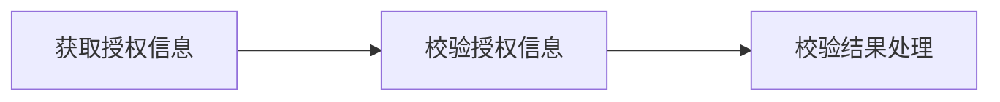
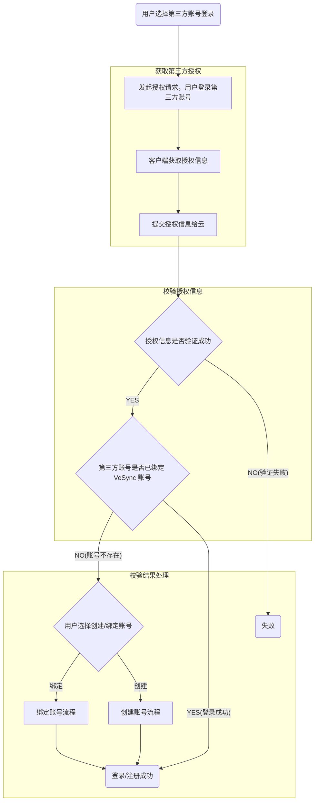
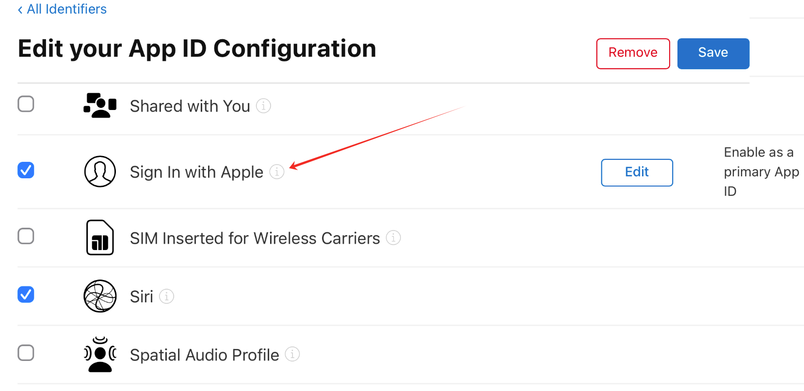
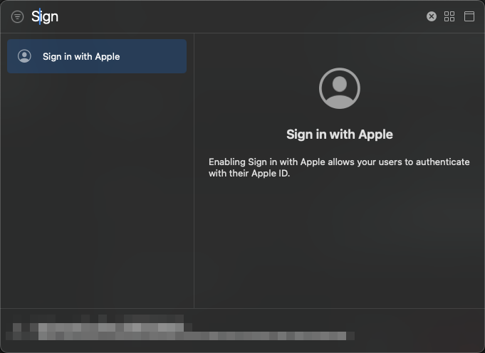
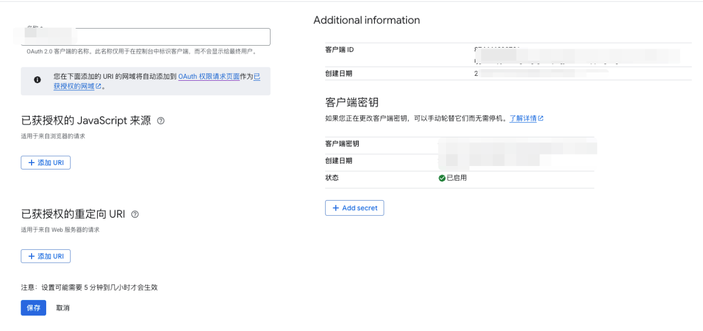
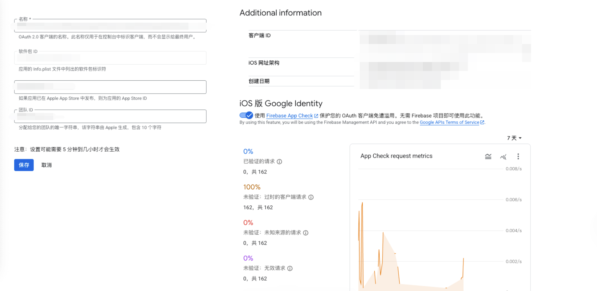
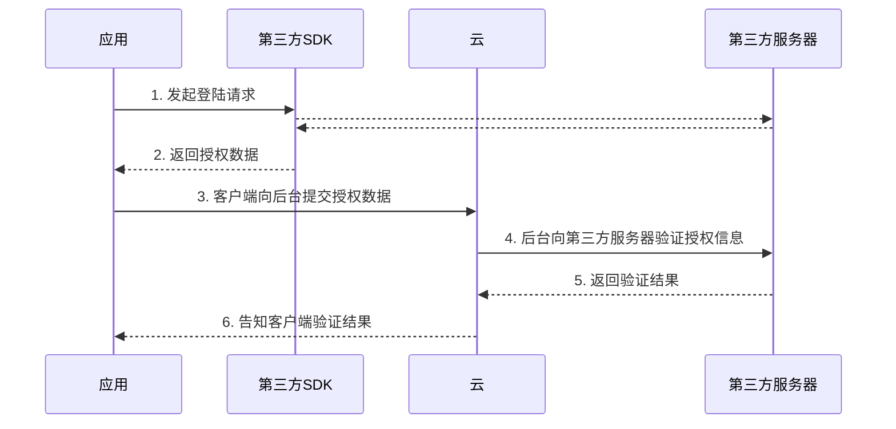
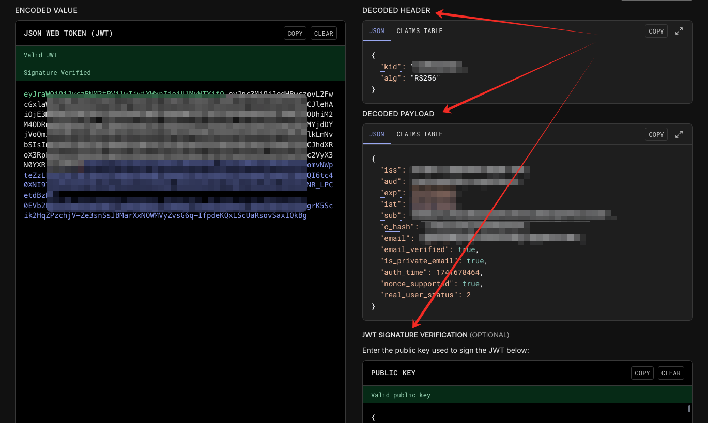
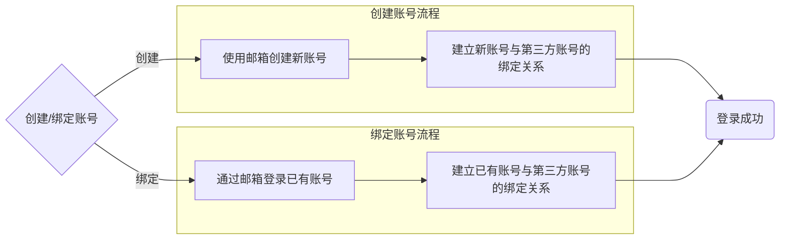

# 前言


现在市面上常见的 App 都开放了第三方平台登录的功能，为用户注册账号和登录账号带来了较大的便利，有效提升了用户的使用体验。近期，我司也引入了 Apple 和 Google 两个平台的第三方账号登录，本文将会对本次第三方平台接入的开发流程做详细的介绍。


# 概述


总的来说，App 要实现第三方账号登录的功能，大体可以按照以下三个步骤来实现：




1. 获取用户授权：通过第三方 SDK 获得用户授权，并获取授权数据用于接入第三方平台服务；
2. 校验授权信息：通过第三方服务校验获得的授权数据，校验成功即可认为是第三方账号认证成功；
3. 校验结果处理：从前两步中，我们可以获得第三方账号的邮箱（或其它的唯一标识），通过这个唯一标识我们可以对接自己平台的账号系统，校验该账号是否已经注册过。如果该账号已经注册或绑定过，则直接登录成功，否则引导用户创建新账号或绑定已有账号。

本小节将会稍微扩展上面的框图的内容，让读者对完整的流程有一个更具体的认知。而后本文后续章节将会以三个步骤作为主题分别进行详细阐述。


## OAuth 2.0


在进入正文之前，我们先提一下 OAuth 协议。


OAuth 2.0 协议是一种三方授权协议，目前大部分的第三方登录与授权都是基于该协议的标准或改进实现，通过这个授权流程，服务提供方允许用户授权第三方应用访问他们存储在另外的服务提供者上的信息，而不需要将用户名和密码提供给第三方移动应用或分享他们数据的所有内容。其基本流程如下所示：


```plain text
+--------+                               +---------------+
     |        |--(A)- Authorization Request ->|   Resource    |
     |        |                               |     Owner     |
     |        |<-(B)-- Authorization Grant ---|               |
     |        |                               +---------------+
     |        |
     |        |                               +---------------+
     |        |--(C)-- Authorization Grant -->| Authorization |
     | Client |                               |     Server    |
     |        |<-(D)----- Access Token -------|               |
     |        |                               +---------------+
     |        |
     |        |                               +---------------+
     |        |--(E)----- Access Token ------>|    Resource   |
     |        |                               |     Server    |
     |        |<-(F)--- Protected Resource ---|               |
     +--------+                               +---------------+
```


这里提及 OAuth2.0 不是为了详细介绍该协议的原理、设计和实现，而是想让读者带着一个高的视角看待第三方登录的流程设计。


实际上，本文是围绕着上图的步骤 A 到步骤 D来进行介绍的，从 A 到 D 即可完成第三方平台账号的授权和验证。由于 VeSync 有自己的账号体系和资源体系，目前也没有使用第三方平台的服务的需求，步骤 E 和 F 在这篇文章中将不会提及。


## 详细流程





概述中的三个步骤在上图中进行了适当的细节扩充，本文将会围绕其进行具体的实现方式介绍，并有一些在开发过程中的踩坑分享。


实际上，上图省略了一些具体业务需求的处理步骤，如检查第三方账号的合法性、第三方账号怎么和 VeSync 账号绑定、各种用户引导及错误处理。这些步骤虽重要，但不具有代表性和通用性，不会在本文作详细说明。


# 获取授权信息


从用户视角看来，点击第三方登录的按钮之后，会有输入框让用户登录第三方账号并请求授权，在登录成功并完成授权动作之后，App 就会开启第三方账号登录的流程。流程的第一步就是通过 SDK 或其它官方途径者获取授权信息。


下面以 iOS 平台为例，介绍获取 Apple 和 Google 的用户授权信息的方式。


## Apple

> ⚠️ 注意
>
> 从 **iOS13** 开始，如果 **App** 提供第三方登录，就必须添加 **苹果登录 Sign in with Apple** 选项，并要求所有开发者于 **2020年4月之前** 完成现有应用的更新，否则审核不通过。
>
>

### 配置

> 要在 App 实现 Apple 登录，需要在工程及开发者账号中都配置相关的功能。
1. 账户配置

    在 Apple 开发者账户中开启 AppID 对应的 Apple 登录的功能，具体流程可以参考[官方文档](https://developer.apple.com/cn/help/account/capabilities/about-sign-in-with-apple/)，创建完成后应如下图：


    

2. 工程配置

    如下图所示在 Xcode 中配置工程的 Capabilities 开启 App 的 Apple 登录功能。


    


### 实现

> 在 iPhone 上，使用原生方式开发的 APP 可以直接调用苹果的框架 `AppleService` 获取 Apple 授权并登录。本部分主要参考 [Apple 官方文档](https://developer.apple.com/documentation/authenticationservices/implementing-user-authentication-with-sign-in-with-apple)。
1. 发起授权请求

    在这个过程中我们需要使用 `ASAuthorization` 服务调起获取 Apple 授权的弹窗。


    我们需要配置的信息有：

    - 需要获取的授权方式`ASAuthorizationAppleIDCredential` ，这个授权方式决定了 Apple 会返回给我们的信息，需要在代理方法中处理。
    - 代理对象 `delegate` ，授权结果会通过代理方法返回给调用方。
    - 需要获取的用户信息`requestedScopes` 在用户首次获取授权的时候，Apple 会通过代理返回这些信息。
    - 配置弹窗上下文 `presentationContextProvider` ，Apple 的授权系统弹窗会在给定的页面弹出，一般来说，这里只要获取导航堆栈中的栈顶控制器即可。

    配置好这些信息后，通过`performRequests()` 调用即可唤起系统弹窗，获取授权。


    ```swift
    let appleIDProvider = ASAuthorizationAppleIDProvider()
    let request = appleIDProvider.createRequest()
    request.requestedScopes = [.fullName, .email]
    
    let authorizationController = ASAuthorizationController(authorizationRequests: [request])
    authorizationController.delegate = self
    if let topVc = Tool.topViewController() as? ASAuthorizationControllerPresentationContextProviding {
    		authorizationController.presentationContextProvider = topVc
    }
    authorizationController.performRequests()
    ```

2. 处理回调事件

    在用户授权成功或授权失败后，会通过两个代理方法通知业务方。

    - `didCompleteWithAuthorization`

        通过回调方法中的 authorization 对象可以获取我们需要的授权信息。在前一步中我们选择获取 AppleID 的授权信息，用于认证授权的参数包括`authorizationCode` 和 `identityToken`，这两个参数的作用和区别将会在下文“校验授权信息”这一小节中详细介绍。


        在用户首次获得用户授权时，SDK 还会提供 `userID` 这个参数给我们。这是一个苹果用户唯一标识符，它在同一个开发者账号下的所有 App 下是一样的，我们可以用它来与后台的账号体系绑定起来。

    - `didCompleteWithError`

        在授权失败时 Apple 会调用该方法，我们可以在这里面做错误处理。


    ```swift
    extension XXX: ASAuthorizationControllerDelegate {
        /// - Tag: did_complete_authorization
        func authorizationController(controller: ASAuthorizationController, didCompleteWithAuthorization authorization: ASAuthorization) {
            switch authorization.credential {
            case let appleIDCredential as ASAuthorizationAppleIDCredential:
                guard let identityTokenData = appleIDCredential.identityToken,
                      let identityToken = String(data: identityTokenData, encoding: .utf8),
                      let authorizationCodeData = appleIDCredential.authorizationCode,
                      let authorizationCode = String(data: authorizationCodeData, encoding: .utf8) else { return }
                let userID = appleIDCredential.user
                self.tryLogin(identityToken: identityToken, 
    							            authorizationCode: authorizationCode, 
    								          userID: userID)
            default:
                break
            }
        }
         
        /// - Tag: did_complete_error
        func authorizationController(controller: ASAuthorizationController, didCompleteWithError error: Error) {
            // Handle error.
        }
    }
    ```

3. 校验授权状态

    除了通过如下方法主动获取用户的授权信息，我们还可以以通知的方式监听用户是否取消了授权，苹果提供的通知名称为`ASAuthorizationAppleIDProvider.credentialRevokedNotification` 。


    ```swift
    let appleIDProvider = ASAuthorizationAppleIDProvider()
    appleIDProvider.getCredentialState(forUserID: KeychainItem.currentUserIdentifier) { (credentialState, error) in
        switch credentialState {
        case .authorized:
            break // The Apple ID credential is valid.
        case .revoked, .notFound:
            // The Apple ID credential is either revoked or was not found, so show the sign-in UI.
        default:
            break
        }
    }
    ```

4. 主动撤销授权

    根据苹果[官方文档](https://developer.apple.com/documentation/signinwithapplerestapi/revoke_tokens)，调用 URL（[https://appleid.apple.com/auth/revoke](https://appleid.apple.com/auth/revoke)）以撤销用户授权。但考虑到以下原因，主动撤销授权的操作应由服务端进行操作。

    - 接口调用需要的参数都保存在云端
    - 多端调用场景（iOS、Android、Web）
    - 数据安全

## Google

> 在 iPhone 上的原生 APP 可以使用 Google 提供的框架 GoogleSignIn 获取用户授权。

### 配置

1. Google 开发者账号配置
    > 这里的配置流程主要参考[官方文档](https://developers.google.com/identity/sign-in/ios/start-integrating?hl=zh-cn#configure_app_project)

    在 Google 开发者账号中创建/获取客户端 ID 和服务器客户端 ID。


    创建好的客户端 ID 如图：


    


    创建好的服务器客户端 ID 如图：


    

2. Xcode 项目配置

    需要在 Xcode 工程配置中添加 Google 开发者账号相关配置信息，把第一步中获取的两个 ID 添加到 `Info.plist` 文件中，形式如下：


    ```xml
    <key>GIDClientID</key>
    <string>YOUR_IOS_CLIENT_ID</string>
    <key>CFBundleURLTypes</key>
    <array>
        <dict>
            <key>CFBundleURLSchemes</key>
            <array>
    		        <string>YOUR_DOT_REVERSED_IOS_CLIENT_ID</string>
            </array>
        </dict>
    </array>
    <key>GIDServerClientID</key>
    <string>YOUR_SERVER_CLIENT_ID</string>
    ```


    其中有两点需要注意：

    1. 如果你的 App 在开发环境与线上环境使用的是不同的 AppID，那上面的账号和项目配置也需要创建两套不同的账号，同时在 plist 文件中也需要按环境区分不同的配置
    2. `GIDServerClientID` 是后端使用的 ID，当 App 的授权流程需要后端身份验证的时候，需要配置该 ID。

### 实现


Google 登录流程比 Apple 登录流程简单，具体如下。

1. 通过 Cocoapods 或者 SPM 集成 [GoogleSignIn](https://github.com/google/GoogleSignIn-iOS) SDK。
2. 发起授权请求

    通过 SDK 的方法获取 Google 授权。授权成功后会执行闭包中的代码，可以在 `signInResult` 中可以获取 userInfo、idToken 等必要信息，进而处理登录业务。


    ```swift
    GIDSignIn.sharedInstance.signIn(withPresenting: self) { signInResult, error in
        guard error == nil else { return }
        // ...
    }
    ```

3. 校验授权状态

    通过 SDK 提供的方法校验用户授权状态


    ```swift
    GIDSignIn.sharedInstance.restorePreviousSignIn { user, error in
        if error != nil || user == nil {
            // Show the app's signed-out state.
        } else {
            // Show the app's signed-in state.
        }
    }
    ```

4. 撤销授权

    通过 SDK 提供的方法主动撤销用户授权


    ```swift
    GIDSignIn.sharedInstance.disconnect { error in
        guard error == nil else { return }
     
        // Google Account disconnected from your app.
        // Perform clean-up actions, such as deleting data associated with the
        //   disconnected account.
    }
    ```


# 校验授权信息


在 App 成功获取授权信息之后，会调用云接口将授权数据传给云端，云端需要校验此信息是否合法，根据采用的获取到的授权信息类型不同，会有不同的校验方式。在这一步骤中，主要是云与第三方平台服务端的交互。





在第三方登录过程中。几个相关角色的交互大致如上图所示，其中步骤 1、2 已经在上文详细介绍过了，本小节将会以 Apple 登录数据验证为例子，围绕步骤 4 和步骤 5 进行介绍。


## Apple


在上文已经提到， iOS App 从 Apple SDK 中可以获取两种授权数据，分别是`authorizationCode` 和 `identityToken`，针对不同的数据，苹果提供了对应的验证方式。


在这里我们介绍一下两种数据：

1. authorizationCode

    本质上是 Apple 颁发的授权码。App 把数据传给云，然后由云端再向苹果的身份验证服务端验证本次授权登录请求数据的有效性和真实性。这是类似 OAuth2 的授权码验证方式。

2. identityToken

    identityToken 是一个经过签名的 JWT 数据 （[JSON Web Token](https://link.juejin.im/?target=https%3A%2F%2Fen.wikipedia.org%2Fwiki%2FJSON_Web_Token)），通过向苹果身份验证服务器获取公钥再进行解密、匹配等步骤，我们可以验证此数据是否被篡改、是否合法。


云端可以自由选择这两个参数进行校验，只要有一个验证方式能够通过，即可视为本次授权校验成功。


### 基于授权码的验证

> 该算法用来验证`authorizationCode` 

使用 authorizationCode 进行验证，调用 URL [https://appleid.apple.com/auth/token](https://appleid.apple.com/auth/token) 进行验证


该流程可参考[官方文档](https://developer.apple.com/documentation/signinwithapplerestapi/generate_and_validate_tokens)，简单的说，就是构建一个网络请求，成功返回即验证成功。


在构建的 request 中有一个 `client_secret` 字段需要我们自行[构建一个 JWT 数据](https://developer.apple.com/documentation/accountorganizationaldatasharing/creating-a-client-secret)，里面包含了开发者账户信息（TeamID、KeyID），应用信息（App 的 BundleID）相关的配置。在构建数据的时候需要注意区分不同开发环境、不同登录客户端，这些差异会导致参数的值不同。


### 基于 JWT 的算法验证

> 该算法用来验证`identityToken` 参数

一个 JWT 有三个部分：header、payload、signature，如下图所示




> 这里附上一个[JWT 在线解析](https://jwt.io/)的工具

服务端在获取客户端发出的`identityToken`后，需要进行如下步骤：

1. 需要逆向构造过程，decode出JWT的三个部分
2. 从[appleid.apple.com/auth/keys](https://link.juejin.cn/?target=https%3A%2F%2Fappleid.apple.com%2Fauth%2Fkeys)中获取公钥，并将公钥[转换](https://link.juejin.cn/?target=https%3A%2F%2F8gwifi.org%2Fjwkconvertfunctions.jsp)为`pem`对JWT进行验证；获取到的公钥会有多个，需要根据 head 里的 kid 和 alg 去选取正确的公钥
3. 如`identityToken`通过验证，则可以根据其payload中的内容进行验证等操作

这里需要再补充说明一下 identityToken 验证原理和方式：`idnetityToken`使用非对称加密 RSASSA（RSA签名算法） 和 ECDSA（椭圆曲线数据签名算法），当验证签名的时候，利用公钥来解密Singature，满足下列条件时，验证通过：

1. 与`base64UrlEncode(header) + "." + base64UrlEncode(payload)`的内容完全一样
2. `iss` 与 `aud` 字段匹配
3. `exp` 过期时间未过

另外，我们从解析出来的 JWT 文件中还能获取到一些其他信息

1. email

    Apple 账号的邮箱。上文已经提过，`ASAuthorization` 服务的登录成功回调事件只有在首次授权的时候才会返回用户信息（用户邮箱），如果后端业务需要使用到用户邮箱，则可以在 JWT 里获取。

2. email_verified

    该字段表明用户邮箱是否已经经过认证

3. is_private_email

    这个字段表明用户是否隐藏邮箱，即用户的邮箱是否为中转邮箱。


    Apple 在首次获取用户授权时会询问用户是否要分享自己的邮件地址给第三方平台。如果用户选择不分享，即隐藏邮件地址，Apple 会生成一个中转邮箱（类似<u>xxxxxx@privaterelay.appleid.com</u>）给到第三方平台以进行必要的业务操作，如第三方平台账号的邮箱信息、发送营销或通知邮件等。

    > 如果需要通过中转邮箱给用户发送邮件，需要在 Apple 开发者账号配置信任邮箱，只有在信任列表里的邮箱才能通过中转邮箱给用户发送邮件、接收用户的邮件。

## Google


Google 登录的验证流程与 Apple 的 JWT 验证流程基本一致（参考[官方文档](https://developers.google.com/identity/sign-in/ios/backend-auth?hl=zh-cn)），其中 App 从 SDK 获取的 JWT 数据参数名为 `idToken` 。


# 校验结果处理


来到这一步，说明我们已经完成第三方账号的授权获取和校验了，此时我们可以将第三方账号的数据对接我们已有的账号系统。


在这个步骤中，业务流程是具体业务需求决定的，并不是一个通用规范的做法，在不同业务主体可能会有不同的设计方案。这里简单介绍一下 VeSync App 的做法。


VeSync 采用邮箱作为 Key 来链接第三方账号和 VeSync 账号。其中，Apple 登录方式的邮箱可以从 JWT 数据中解析出来，Google 登录方式的邮箱则是由 SDK 直接返回，由 App 传给云端即可。


云会校验该邮箱是否已经绑定过 VeSync 账号：

1. 已绑定

    这意味着这个第三方账号的用户已经通过三方登录的方式创建过账号，或绑定过账号。此时我们可以直接为该用户颁发通行密钥（token），App 拿到密钥之后可以直接登录，使用 VeSync 的服务，此时我们获取第三方账号的信息是用来**登录**的

2. 未绑定

    此时 App 需要引导用户绑定已有账号或创建新账号，大致流程如下所示。就是此时我们获取第三方账号的信息可能用来**登录**或**注册** 。流程结束后，用户即可成功登录使用 VeSync 的服务。


    需要额外说明的是，在建立已有账号与第三方账号的绑定关系的过程中，需要校验已有账号是否已经绑定过同一平台的第三方账号，如果已经绑定过，则需要额外的流程（如直接替换，或提示用户选择其中一个）进行处理。





在完成账号的创建和绑定过程之后，与第三方账号相关的业务流程就结束了。此时我们会处于登录状态，用户就可以使用 App 了。


# 尾声


通过本文的介绍，我们了解了第三方授权信息的获取和校验的流程，同时大致梳理了现行账号体系接入第三方账号的流程，希望这些内容能够帮助到您。


感谢您的阅读，希望本文对您在接入第三方平台登录方面有所启发。

