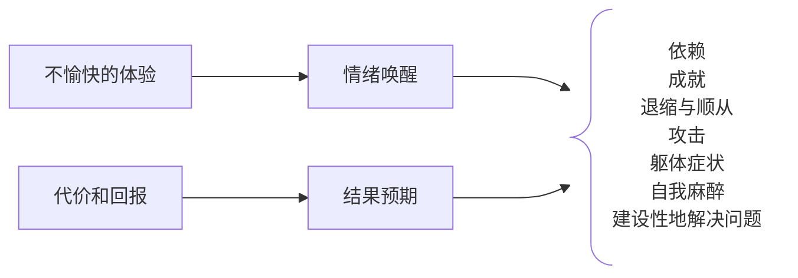
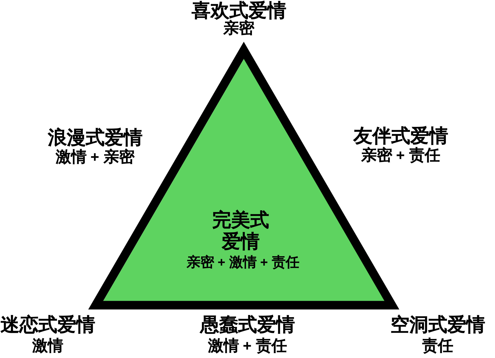

# 社会关系（上）

> 社会中人们的联系过程

## 偏见：不喜欢他人


### 本质和作用

- 偏见的本质

    对群体及其成员负面的预先判断，负面评价是偏见的标志

    - `刻板印象`是有关其他群体的信念，一种概括性的看法，可能准确/不准确/过度概括，但它是基于事实核心的。

        刻板印象（信念）不是偏见（态度），刻板印象可能为偏见提供支持

    - 偏见是一种负面<u>态度</u>，歧视是一种负面<u>行为</u>，歧视行为的根源往往在于偏见

        态度和行为松散地结合 → 偏见性的态度并不一定会滋生敌意行为

    - <u>**种族歧视**</u>和<u>性别歧视</u>是制度性的歧视举动
- 偏见的微妙形式和公开形式
    - 双重态度系统：外显（有意识的）态度和内隐（无意识的，自动的）态度

        偏见和刻板印象可以在人们的意识之外产生（内隐偏见）

    - 微妙形式（现代偏见）

        偏见态度或歧视行为一旦能隐藏于某些其他动机之后便可能浮现出来


        在行为层面表现出的偏见（尽管表面上不承认）


        也会表现为种族敏感性、怜悯姿态（赞扬过度和批评不足）

    - 自动偏见（自动的内隐偏见）

        没有明确表示出偏见，只有无意识、非故意的反应


        一些研究表明，内隐偏见会改变行为；在一些情境中，自动的内隐偏见会影响一个人的生死（警察 & 黑人）


### 社会根源

- 社会不平等
    - 不平等的社会地位滋生了偏见
    - “善意”和“恶意”的歧视：我们敬重地位高的人所具有的能力，同时也喜欢那些欣然接受地位较低的人
    - 一个具有社会和经济优越性的群体，往往会以偏见的信念来保护他们的地位（`社会支配性取向`高）
    - 社会不平等也造就了不信任：群体之间收到的待遇越不平等，群体见的信任和合作就越少
- 社会化
    - 偏见还起源于其他社会原因，包括我们习得的价值观和态度

        家庭社会化对儿童偏见有影响，这往往与家庭的教育有关。（儿童的内隐种族态度反应的是父母外显的偏见）

    - `权威人格`
        - 权威人格：不能容忍软弱、具有惩罚性的态度、服从群体内部的权威
        - 具有权威人格的个体容易出现偏见和刻板印象

            表现：小题大做、热衷报复、对敌人去人性化


            原因：

            - 童年收到苛刻管束 → 压抑自己的冲动和敌意 → 投射到外群体身上
            - 不安全感 → 特别关注权利和地位 → 非对即错、难以忍受模糊性
        - 权威人格+社会支配性取向高的人偏见最深
    - 宗教
        - 得益于不公正的人利用宗教来维护不公正，为不平等寻求合理化的辩解
        - 宗教与偏见的关系

            如果将宗教虔诚定义为认同传统信仰的意愿，那么越虔诚的人就有越多的种族偏见


            如果以其他方式定义，那么越虔诚的人就有越少的种族偏见（现代民权运动有宗教根基）

        - “宗教制造偏见消，又除偏见”
    - 从众
        - 偏见形成之后会由于惯性而持久存在。如果偏见被社会接受，许多人将会顺应这种潮流
        - 当人们知道别人也是如此后，会变得更容易赞成/反对歧视（不从众的代价高）
        - 如果偏见并非出于人格，那么随着潮流改变和新规范演进，偏见就可能消除
- 社会制度
    - e.g. : 种族隔离助长偏见、学校强化了主流的文化态度
    - 社会制度对偏见的支持往往是不知不觉的（面孔歧视、黑人说唱的暴力倾向）

### 动机根源


`替罪羊理论` 

    - 替代性攻击：痛苦和挫折（目标受阻）引起敌意；当原因令人胆怯或尚未可知时，常常会转移敌对方向；替代性攻击的目标是变化不定的
    - 当两个群体为工作/住房/社会声望竞争的时候，一个群体实现了目标，这将成为另一个群体的挫折
        - `现实群体冲突理论` ：一旦群体为稀缺资源竞争，就会出现偏见
        - 高斯定律

社会同一性理论

- 自我的概念包含个人同一性（我们对自己的个人特性和态度的感受）和社会同一性（我们所扮演的各种社会身份）
- `社会同一性理论`：
    1. 归类：将人归入各种类别，打上标签
    2. 认同：将自己与特定群体（内群体）联系起来，并以此获得自尊
    3. 比较：将自己的群体与其他群体（外群体）进行比较，并偏爱自己的群体

    社会同一性 → 服从群体规范 → 对群体依恋 → 受到其他群体威胁产生偏见


    个人同一性及自豪感（个体成就、自我服务偏差）、社会同一性及自豪感（群体成就、内群体偏差）→ 自尊

- `内群体偏差`
    - 以群体方式描述自己（外群体）意味着把自己排除出其他群体（外群体），可能增加内群体偏差
    - 内群体偏差提供积极自我概念

        大部分人有积极的自我意象并投射到内群体


        内群体偏差反映出消极的自我概念，但同时也支持了他们的自我概念

    - 内群体偏差滋生偏袒

        只要有理由认为我们是一个群体（即使毫无逻辑），我们就会这么做（认同群体），随后产生内群体偏差


        只要一点线索就能激发对自己的偏袒和对他人的不公


        当内群体相对于外群体规模较小、社会经济地位低的时候，更容易表现出内群体偏差

    - 喜欢内群体是否必然讨厌外群体

        当人们敏锐感觉到内群体身份时，外群体刻板印象就容易盛行


        “非人化”：否定外群体的人类属性（对宠物赋予人性，对外群体人员去人性化）


        对内群体所持的积极感受并不一定完全映射出对外群体同样强烈的消极感受

- 社会地位、自我关注、归属的需要
    - 从偏见可中可以获得的一个心理优势就是高人一等的感觉：社会地位低或积极的自我形象受威胁的群体，偏见往往更强烈
    - 恐惧管理策略：蔑视那些不断挑战他们世界观、使他们感到更焦虑的人
    - 自我形象和偏见的联系：获得肯定，人们将对外群体做出更高的评价；而自尊受到威胁就会诋毁外群体，以恢复自尊
    - 蔑视外群体可以满足内群体的归属需要：知觉到一个共同的敌人会使一个变得群体团结起来
    - 一旦归属感的需要获得满足，人们就变得更为接纳外群体
- 避免偏见的动机
    - 不好（不和谐）的想法和情感往往长久存在，虽然我们会主动抑制这些想法，但这并不是容易的事情
    - 避免偏见的动机会使人们调整自己的思维和行动，当意识到他们应该如何去感受和实际如何感受的差距的时候，具有自我意识的人就会产生内疚感，并努力抑制偏见反应
    - 避免偏见的动机是内在（因为偏见是错误的）而不是外在（不愿意让别人把他们想的太坏）的时候，即便是自动的偏见也会有所减弱
    - 通过提高意识和关注程度，用无偏见的自动反应替代偏见反应，可以克服偏见

### 认知根源


类别化：将人归入不同群体


    刻板印象 & 认知效率：刻板印象和外群体偏见有助于竞争和生存

    - 自发类别化

        我们无法抗拒将人归入不同群体的倾向，这种类别化本身不是偏见，但它确实为偏见提供了基础


        在社会同一性理论看来，对社会身份更敏感的人会更关注自己，有更强的类别化倾向

    - 知觉到的相似性和差异性

        `外群体同质效应` 认为外群体都是相似的，而内群体都是独特的（内群体偏好）


        一般而言，越是熟悉某一社会群体，就会看到越多的多样性；越不熟悉，刻板印象就越严重；类似的，一个群体越弱小，我们对其关注越少，刻板印象就越严重


        `本族偏差`： 自己种族群体以外的其他任何种族成员看起来都很相似，类似的也有`同龄偏差`


独特性：感知那些突出的人

- 独特的人

    一个独特的个体，如唯一的一名少数种族个体，具有引人注目的特点，会引起人们注意，优缺点都会被放大，倾向于发生的所有事情都是这个人引起的


    人们倾向于以最独特的特质来描述一个人（跳伞>篮球，养蛇>养狗）


    人们关注违背期望的人（来自社会底层但很有才能的求职者）

    - 独特性形成<u>自我意识</u>：有时候人们会错误地认为他人的反应是针对我们的独特性的（“被丑化”的女生对别人的反应变得更加敏感）
    - <u>污名意识</u>：人们在多大程度上<u>预期</u>他人会对他们产生刻板印象，把自己看成流行偏见的受害者

        消极意义：生活在刻板印象的威胁、想象中的对立等压力中，有较低的幸福感


        积极意义：偏见直觉为个体的自尊提供了缓冲（”不是针对我”）

- 独特案例

    以一些独特案例作为判断群体的捷径（“身边统计学”？）：针对特定的某一社会群体，已知有限的经验，我们回忆案例并由此概括出结论


    少数群体的个体越独特，多数群体就会越高估这一群体的人数（高估非穆斯林国家的穆斯林人口比例）


    独特的案例也会强化刻板印象（有极端身高的群体会高估高个子的数量）

- 独特事件促进`虚假相关`

    刻板印象假定在群体成员身份和个人特征之间存在某种相关性（意大利人多愁善感，犹太人精明能干），但我们对非同寻常的事情的格外关注也会产生虚假相关


    即使非典型群体中的某个人只做出一次不常见行为，便可以让人形成虚假相关（同性恋者/精神病人杀人）


    预先存在的刻板印象能“引导”我们感知到根本不存在的关联性


归因：世界公正性


    考虑基本归因错误：热衷于将他人的行为归结于他们的内在倾向，而忽视重要的情境力量

- `群体服务偏差`

    对内群体成员给与善意的理解，从坏的角度解释外群体的成员行为；外群体成员的积极行为相对而言经常被忽略，被视为个例


    语言性群体偏差：群体服务偏差会微妙地影响我们的语言风格

- 自我强化的社会同一性如何支持刻板印象

    |          | 内群体        | 外群体        |
    | -------- | ---------- | ---------- |
    | 态度       | 偏爱         | 诋毁         |
    | 知觉       | 异质性（我们不一样） | 同质性（他们很相似） |
    | 对消极行为的归因 | 归于情景       | 归于内在品质     |

- <u>公正世界现象</u>

    指责受害者（受害者有罪论）源于一个公认的假设：因为这是一个公正的世界，人们得到的是他们应得的一切；低估了不可控因素的力量


    人们之所以对社会不公漠不关心，不是因为他们不关心社会不公，而是眼里看不到不公正（相信世界公正的人认为被强奸的受害者一定行为轻佻）


    公正世界思维会让人认为所处文化中熟悉的社会系统是公正的；但新的社会政策实施后，我们的“制度正当化”会发生作用以支持该政策


### 偏见的后果

- 自身永存的刻板印象
    - 偏见是一种预先判断：引导我们的注意和记忆，还会引导我们对事件的解释（行为符合预期——重视这一事实，想法获得验证；不符合预期——归类为特殊情形）
    - `再分类`（把偏离常规的人归入一个不同的类群）：当我们集中关注反常事例时，我们可以分出一个新的范畴来维护已有的刻板印象，维护刻板印象
    - `再分群`（形成一个子群体的刻板印象）：倾向于让分化中的刻板印象适度地发生变化，对不适合的人形成新的刻板印象
- 歧视的影响：自我实现的预言
    - 歧视会通过自我实现的预言创造出相应的现实
- 刻板印象威胁
    - `刻板印象威胁` ：一种自我验证的忧虑，担心有人会依据负面刻板印象来评价自己。这种威胁会消耗我们的精力与注意力，导致我们心理与生理机能下降
    - 刻板印象威胁破坏表现的方式
        1. 压力：刻板印象的压力会减少与处理数学问题有关的大脑活动，同时增加与情绪加工有关的脑区活动
        2. 自我监控：担心犯错会影响注意力的集中
        3. 抑制不需要的情绪与思维：调整思维消耗一个人的认知资源，干扰工作记忆
    - 负面刻板印象干扰成绩，但是正面刻板印象似乎能促进成绩
- 使个体判断出现偏差

    正面

    - 刻板印象通常可以反映现实（尽管有时会扭曲）
    - 人们在评价个体的时候，往往比评价由这些个体组成的群体时更为积极
    - 关于一个群体特定成员琐碎但生动的信息，往往比群体的一般信息更有效；当这个特定成员与我们对该群体的刻板印象不符时，这一效应尤其突出

    反面

    - 强烈且显然相关的刻板印象的确能够印象我们对个体的判断（男女性身高判断、一些关于性别的刻板印象）
- 扭曲认知解释
    - 当我们做判断或开始与某人交往时，有可能只依赖于刻板印象，这时刻板印象能强烈地扭曲我们对人的解释和记忆
    - 当人们的行为违背了我们的刻板印象时，我们会对他们做出比较极端的评价

## 攻击：伤害他人


攻击的定义：意图伤害他人的身体行为或言语行为

    - `敌意性攻击`：由愤怒引起，以伤害为目的，是“激烈的”（谋杀）
    - `工具性攻击`：把伤害作为达到其他目的的一种手段，是“冷静的”（战争、恐袭）

### 攻击的理论

> 在分析敌意性攻击和工具性攻击的原因时主要有三种观点：生物学影响、挫折、习得行为

生物学理论

- 本能理论和进化心理学：攻击性的能量来自本能，是非习得的和普遍的；男性尤其发现攻击行为具有适应性，有目的的攻击可以提高生存和繁殖的几率
- 神经系统的影响：攻击行为不受某个特定区域的控制，但还是存在一些能够引发攻击的神经机制；脑区异常可能导致攻击行为
- 基因的影响：遗传因素影响神经系统对暴力线索的敏感性
- 生物化学因素：血液中的化学成分会影响神经系统对攻击性刺激的敏感性（酒精、睾丸激素）

    生物学和行为之间的作用是相互的（睾丸激素促进支配欲和攻击性的产生，同时支配或取胜的行为也会提高睾丸激素的水平）


挫折——攻击理论

> 该理论解释的是敌意性攻击，而非工具性攻击
- 理论含义：挫折（阻碍我们实现目标的事物）总会导致某种形式的攻击

    攻击的能量并非直接朝挫折源释放 → 克制直接的报复（特别报复会导致不好的后果）→ 敌意`转移`到一些安全的目标上 → 外群体的目标尤其容易成为替罪羊

- 挫折——攻击理论的修正：挫折产生的是愤怒（攻击的一种情绪准备状态）

    如果这种挫折是可以理解的，那么它只会导致愤怒，不会导致攻击；一旦有攻击线索出现，就容易形成攻击


    ```mermaid
    graph LR
    a[无法接受的挫折] ---> b[愤怒]
    b --+攻击线索--> c[攻击]
    ```

- 相对剥夺

    不只是完全的剥夺会产生挫折感，更多的挫折感来源于`期望和现实之间的差距` ，即`相对剥夺`

    - 自我服务偏差 → 期望比别人获得更多 → 期望与现实的差距 → 相对剥夺
    - 电视中描绘的富裕生活 → 把绝对剥夺转化成相对剥夺

社会学习理论

> 学习可以引发“攻击”
- 攻击的回报

    亲身经历/观察 → 学习到攻击能带来好处 → 引发攻击（工具性攻击）

- 社会学习理论：人们对攻击的学习不仅发生在亲身体验其后果时，通过观察别人也能进行同样的学习；当看到别人表现攻击行为并没有收到惩罚时，我们会习得攻击
- 学习的来源
    - 家庭：有攻击性惯于体罚的父母
    - 文化：暴力亚文化（“名誉文化”，以暴制暴）




### 攻击的影响因素


厌恶事件、唤醒、攻击线索

1. 厌恶事件：厌恶事件而非挫折才是敌意性攻击最基本的诱发因素
    - 疼痛：肉体疼痛和“心理疼痛”（即挫折）会提高人类的攻击性
    - 炎热：在炎热条件下的人更为疲惫，更富有攻击性，还可以引发报复行为
    - 攻击：受到攻击或者侮辱尤其容易引发攻击
2. 唤醒：唤醒的状态会`强化情绪`

    挫折、炎热或侮辱性的情景都会提高我们的唤醒水平，这种唤醒状态会与敌对的想法和情绪一起促成攻击性行为

3. 攻击线索：攻击线索的增加了攻击行为的可能性

    看到武器（尤其是武器被视为暴力工具而非消遣时）会启动敌对性想法和惩罚性判断（启动效应）诱发暴力行为


媒体影响：色情作品和性暴力

- 色情作品和性暴力：观看含有性暴力（男人制服女人，激起她的性兴奋）的场景会
    1. 对性现实的歪曲理解：歪曲其关于女人对性侵犯的真实态度的认识，扭曲他们关于女性对性胁迫的知觉

        接触色情信息会增强人们对“强暴谬论”（女性会欢迎性骚扰，说不要不是真的不要）的接受度，看过含有性暴力的描写的电影的人更容易接受对女人施以暴力的行为

    2. 针对女性的攻击：增加男人对女人的攻击

        色情作品会导致男性对女性的实际攻击（经常看色情网站的男人表现出更强的攻击性）；暴力色情刺激增加了对女性的惩罚性行为


媒体影响：电视和互联网

- 电视对行为的影响
    - 看电视与行为的相关研究表明：一个儿童看的电视节目中包含的暴力内容越多，那么他的攻击性越高
        1. 8 岁时观看暴力电视与其成人时期虐待配偶的可能性存在相关
        2. 青春期观看暴力电视与其之后发生殴打、抢劫和恐吓的可能性存在相关
        3. 小学生观看暴力节目越多，2～6 个月之后他们参与的打架次数就越多
    - 看电视的实验研究证实了观看暴力导致攻击增加的结论：观看媒体中的暴力，无论是即时的还是长期的情况下，均会增加攻击行为和暴力行为
        - 观看一部暴力电影的愤怒的大学生比观看一部非暴力电影的大学生表现出更强的攻击性
        - 观看暴力影片的人表现出更多的敌意，这些敌意并不是袭击和殴打，它更多的表现为威胁性动作的水平
        - 当一个有魅力的人因正当理由而实施了适度的暴力，而这种暴力未受惩罚却没有造成任何伤害时，观看暴力节目的效果是最为显著的
    - 看电视会影响行为的三种可能性
        1. 导致社会暴力行为的不是暴力内容本身，而是其造成的`唤醒状态` （唤醒状态强化情绪导致引发行为）
        2. 观看暴力使人们`降低抑制`，引发暴力行为
        3. 媒体内容引起`模仿`（如果媒体内容真的导致模仿，那对亲社会行为的塑造对社会就是有利的）
- 电视对思维的影响
    - `脱敏作用`：重复呈现一个激发情绪的刺激，会导致情绪反应的消失和麻痹

        常看暴力影片的人与不常看的人相比，面对暴力行为的反应更小（脱敏）

    - `社会脚本`：当我们发现自己在新的环境中，不知道该如何行为，我们就会依赖社会脚本（即文化提供的关于如何行为的心理指导）

        媒体为青少年灌输了一些特定的社会脚本（看过太多动作影片之后，年轻人会形成一个脚本以在他们碰到真实的冲突时起作用）

    - `改变知觉`：媒体塑造了对现实的知觉

        看电视多的人比看电视少的人更容易夸大周围世界发生暴力的频率，更害怕遭到人身攻击

    - `认知启动` ：观看暴力录像带可能会激活与攻击有关的概念网络
    - `消耗时间`：与更多的娱乐活动相比，长时间的看电视消耗了人们的精力，压抑人们的心境

媒体影响：电子游戏

- 玩暴力游戏可能比观看暴力电视更容易诱导人们做出攻击性行为：
    - 认同暴力人物的身份并进行角色扮演
    - 积极地演练暴力活动，而不是被动观看，并参与暴力活动的全过程
    - 不断地重复暴力行为
    - 从有效攻击中获得奖赏

    大量研究表明，玩暴力电子游戏确实会增加攻击性行为、攻击性思维和攻击性情绪

- 玩暴力电子游戏产生如下一系列效应
    - 诱发攻击性行为：玩过暴力游戏的儿童在与同伴相处时更容易表现出攻击性倾向
    - 引发攻击性思维：对他人行为进行预测时，更倾向于认为他人会做出攻击性反应
    - 唤醒攻击性情绪：挫折体验增强，表达出的敌意也更多
    - 减少对他人的帮助和同理心
    - 对攻击的脱敏：人们在玩暴力游戏之后，变得更容易利用同伴而不是信任或合作，其余情绪有关的脑区表现出了更少的激活，即对暴力脱敏；玩的时间越长，这种效应越明显

    ```mermaid
    graph LR
    a[反复玩暴力游戏] --> b --> e[攻击性人格的增强]
    
    b@{ shape: comment, label: "攻击信念和态度
    对攻击的感知
    对攻击的预期
    攻击行为脚本
    对攻击的脱敏" }
    ```

- 宣泄假说
    - 假说认为，暴力游戏可以让人们以一种安全的方式表达自己的攻击倾向
    - 但批评者指出，暴力游戏会让愤怒升级，并导致更多攻击行为
- 电子游戏的双面性
    - 并非所有游戏都包含暴力情节，甚至暴力游戏有助于提高手眼协调能力和反应速度
    - 玩游戏的关键乐趣在于帮助人们满足竞争、控制和社交等基本需要
    - 亲社会游戏教给孩子亲社会行为（帮助、分享和合作行为）

群体影响

- 群体通过`责任扩散`使攻击行为增大
    - 责任扩散随着距离的增大和人数的增多而变强（去个体化现象）
    - 通过社会“传染”，群体能够放大攻击倾向，正如他们极化其他倾向一样
    - 随着群体同一性的发展，服从的压力和去个体化增加，导致了<u>群体唤醒、去抑制和极化</u>

### 减少攻击行为


宣泄假说问题

- 宣泄的提出

    一般认为，宣泄的概念是由亚里士多德创造的，他提到我们可以通过体验情绪来摆脱它们，通过观看经典悲剧而达到一种对怜悯和恐惧情感的宣泄；他认为，让某种情绪兴奋，就是让那种情绪得到释放

- 宣泄假说的否定事实
    - 性期刊订阅率高的地区强奸率高
    - 加拿大和美国的足球、摔跤比赛的观众在观看赛事后表现出更多的敌意
- `行为会影响态度`

    米尔格拉姆的服从实验中提到，轻微的攻击行为可以为自己找到正当理由，人们贬低受害者从而使进一步的攻击合理化


    报复从短期看可以减少张力甚至提供快乐，但从长期看却能激起更多的负性情绪

- 减少攻击行为的方法
    - 分散注意力
    - 用非攻击的方法来表达自己的感觉，以各一种能使别人更好的做出积极反应的方式交流感受

社会学习法

> 如果攻击行为是习得的，那就存在控制它的希望
- 厌恶体验导致敌意性攻击 → 避免设定错误的、不可达到的预期
- 惩罚的局限性 & 奖励合作性的非攻击行为
    - 惩罚攻击者的效果不稳定，只有当惩罚措施严厉、及时、确定，当它和对期待的行为进行奖励结合起来，而且接受者不愤怒这样的理想条件下，威胁性惩罚才能消除攻击

        体罚同样会产生消极作用：惩罚是一种令人厌恶的刺激，它为我们尽力防止的行为提供了榜样，且他说强迫的，我们很少因为外部理由而强迫内化某种行为

    - 惩罚的有效性也是有限的，多数致命的攻击是一时冲动、激烈的攻击；惩罚只对冷静的工具性攻击有效 → 用攻击之外的手段解决问题

        教授解决问题的技巧、情绪控制策略和冲突解决方法后，学校中的暴力或破坏行为的儿童比率有所降低

    - 训练家长用非暴力的方式教育孩子，鼓励家长强化期待的行为，积极而非消极地表达观点
- 减少观看攻击情境（导致降低抑制和模仿）
    - 减少媒体中的野蛮、缺乏人性的描写
    - 教育儿童抵制媒体暴力的影响
- 文化改变和世界暴力
    - 人类的文明程度越来越高，各种形式的暴力都在减少
    - 废除死刑

## 吸引与亲密：喜欢他人与爱他人

- 作为社会性动物，我们有一种强烈的`归属需要`（与他人建立持续而亲密的关系的需要），我们需要归属与某一群体
    - 满足归属需要，并与另外两种人类需求（自主感和能力感）保持平衡，通常就会带来深深的幸福感。幸福感是感觉与人有联结，自由以及有能力
    - 归属需要被排斥行为（拒绝或忽视）阻碍时，人们尝尝感觉抑郁、焦虑、感到情感被伤害并尝试努力修复关系，以至最后陷入孤僻
- `社会排斥`的痛苦非常真实，使人表现出更多挫败行为，还可能对自己的行为失去控制
    - 被排斥的人其大脑皮层的某个区域活动增加，而这部分脑区同样也是对躯体创伤做出反应的脑区
    - 感受到爱是社会排斥的对立面，爱可以激活大脑的奖赏系统。社会排斥是一种真实的疼痛，而爱是天然的止痛剂
    - 被排斥的经历会导致人们无意识中增加对他人行为的模仿

### 导致友谊和吸引的要素


接近性

- 两个人是否能成为朋友的强有力的预测源是<u>接近性</u>，尽管接近性也可能诱发敌意，但更容易产生喜欢
- 相互交往：接近性的关键因素是功能性距离（人们的生活轨迹相交的频率）而非地理距离

    对相互交往的预期就可以引发喜欢：预期的喜欢（期望某人是令人喜爱的和容易相处的）能增加与之建立互惠关系的机会

- 曝光效应：熟悉诱发了喜欢，曝光能提高人们对新异刺激的评价

    曝光效应能诱发愉快的情感（除非是没完没了的重复）；<u>未被察觉到的曝光</u>也能引起喜欢，甚至作用更强烈 

    - 情绪相比于思维更有即时性：它是一种可以预定我们的吸引和依恋倾向的硬件现象，有助于我们把熟悉的安全的事物与不熟悉不安全的事物区分开
    - 曝光效应的缺点：我们对陌生环境的警惕、偏见、刻板印象
    - 我们更喜欢以常见的方式展现的自我（自己更熟悉的）

外表吸引力

- 对于约会陌生人的实验室研究和现场研究都表明，大学生更倾向于选择外表有吸引力的人（约会），并且男性比女性更重视约会对象的外表吸引力
- `匹配现象`：人们一般跟自己具有同等吸引力的人结成伴侣（不仅在智力、受欢迎程度和自我价值上，而且在外表吸引力方面都能与自己匹配）
    - 在吸引力不匹配的情况下，吸引力较差的一方通常具有其他方面的品质对自己的外表进行补偿，男性→ 财富或地位，女性 → 年轻有吸引力
- 外表吸引力的刻板印象：美的就是好的

    在其他方面条件都相同的情况下，我们仍会猜测漂亮的人会更快乐、性感热情、更开朗、聪明和成功；大多数人都认为，长相一般的孩子，他们的才干和社交技能都不如那些漂亮的同龄人

    - 第一印象：吸引力可能对第一印象的影响最大

        随着社会变动性增大以及城市化进程的加快，人与人之间的接触越来越短暂，第一印象显得就愈加重要


        第一印象形成的速度非常快，它对思维的影响也非常大（美丽意味着成功），人们迅速感知到美，并启动了积极加工的过程

    - “美就是好”这种刻板印象准确吗？

        研究表明，被评为最具外表吸引力的人是那些最有社交技能和最讨人喜欢的人。外表有吸引力的个体，也往往更受欢迎，更外向，更具典型的性别特征


        有无吸引力的人之间的微小差异很可能来源于`自我实现预言` ：有吸引力的人通常更受重视，更讨人喜欢，并大多因此变得自信

- 谁具有吸引力

    严格说来，吸引力指的是无论何时何地人们所发现的任何具有吸引力的特征；这对不同时代不同背景的人有不同的定义标准；真正的吸引力是完美的平均、完美的对称（的面孔）

    - 进化与吸引力：我们是被原始的吸引力驱动的

        从生物学角度看，美丽其实反映了一些重要信息：健康、年轻和富于生殖能力（男性喜欢能显现生殖能力的女性特征， 女性偏好能够“提供和保护资源”的男性特征，但两性都喜欢有爱心和聪明的人）

    - 社会比较：吸引力并不只是取决于生物特性，还取决于自己的`比较标准`

        观看色情电影会降低自己对伴侣的满意度；性唤起可能暂时地使异性看起来更具吸引力


            对比效应同样也在自我觉知过程中发挥作用：看到魅力非凡的同性之后人们会觉得自己缺乏吸引力，男性进行自我批评的愿望也会因为接触了更有权力、更成功的男性而变得不强烈

        - 这种比较标准使我们低估同伴和自己
    - 所爱之人的吸引力

        当越来越喜欢一个人时，他对你的吸引力会不断上升，外表上的不完美就不那么明显了，且不觉得其他异性吸引人 → 情人眼里出西施


        被描述为热情、乐于助人、善解人意的人<u>看起来</u>会更有吸引力 → 心美貌也美


相似性与互补性

- 相似性——物以类聚
    - `相似导致喜欢`

        当某人的态度、特质和价值观与自己越相似，就会越喜欢他；现实情况很重要，但对现实的`知觉`更重要


        人们还会喜欢与自己行为一致的人，微妙的模仿还会产生喜爱之情（当某人对某事的观点与你相同，并附和你的想法时候，你就会感到些许友善和喜爱之情）

    - 不相似导致不喜欢

        我们有一种错误的一致性偏好（倾向于认为别人与我们拥有同样的态度），当我哦们发现某人与我们的态度不一致时候，我们就会倾向于减少对这个人的喜欢；总之，不同的态度对喜欢的抑制作用甚于相似态度对喜欢的促进作用，`态度一致性`有助于人们促进和维持亲密关系


        由于文化多样性程度的提高，而我们对于差异又有天生的警惕性，尊重和欣赏差异也许是我们这个时代主要的社会挑战（接纳文化多样性）

- 互补性——对立引发吸引吗？

    某些方面的互补性（如支配性和被支配性）的确可以促进关系的改进，但人们更倾向于喜欢那些在需求和人格方面相似的人相处；但一般来说，对立者并不相吸


喜欢那些喜欢我们的人

> 接近性和吸引力影响我们最初为谁吸引，而相似性会影响长期的吸引；我们也很可能和那些喜欢我们的人建立友谊关系
- 一个人喜欢他人的程度，可以反过来预测对方喜欢他的程度

    告知某些人他们被别人喜欢或者仰慕时，他们就会产生一种回馈的情感，尤其是喜欢你而不是别人时，这种情感回馈会更好


    一点点不确定性也能燃起渴望：某人可能喜欢你，但你不太确定，你往往更会对他念念不忘，觉得他很有吸引力


    无论我们评价自己还是别人，消极信息都占了更大的权重：相较于积极信息，消极信息更不寻常，更能抓住人们的注意力（缺点比优点更有影响力）

- 归因：我们的反应依赖于我们的归因

    我们是不是把赞美归因为一种讨好（自我服务的一种策略）？如果没有明显的别有用心的动机，我们就会接受奉承者和他们的奉承

- 自尊和吸引：自尊心受到打击并极为渴望获得社会承认的人会容易被别人吸引

    人们有时在遭遇一次很伤自尊的拒绝之后会表现出一些反弹行为，如坠入充满激情的恋爱当中

- 获得他人的尊重

    当个体获得了目标人物的尊重，尤其是当这种尊重的获得是逐渐发生的，并且还推翻了目标人物先前的批评时，个体会更加喜欢这个目标人物（由于先前对美言的吝啬，才使得对方听到赞赏后特别满足）

- 频繁的赞扬可能会失去价值；与过度赞扬相比，保持`坦率和真诚`的关系（互相尊重，彼此接纳，保持忠诚）更可以持续地让对方感到满意

    有些真爱我们的人虽然很诚实，但倾向于过分乐观地看待我们（过分理想化的积极偏见）；研究表明那些`相互理想化`的伴侣过得最开心


    真诚对营造两人之间的良好关系很重要，但假定对方天性善良同样重要


关系中的奖赏

- 我们在解释为什么被吸引时，往往忽略了我们自己（这被视为是最重要的） → 吸引体现在被吸引一方的眼中
- 吸引奖赏理论（回报性特质）
    1. 我们喜欢那些回报我们或与我们得到回报有关的人

        如果跟某人交往所得到的回报大于付出的成本，那我们就喜欢并愿意继续维持这种关系


        当一方满足了另一方没有得到满足的需求的时候，就会产生互相吸引

    2. 我们还喜欢那些让我们心情愉悦的人交往，人们通过条件反射形成了对那些奖赏性有关的事和人的积极感受
- 通过吸引奖赏理论解释吸引的一些影响因素
    - <u>接近性</u>能够带来报偿：与近邻或同事的关系中获得友谊的好处所付出的时间精力都比较少
    - 我们喜欢有<u>吸引力</u>的人，因为我们觉得他们会具备一些我们所期望的品质，与他们结交能使我们受益
    - 如果他人的观点与我们<u>相似</u>，我们会觉得得到了回报，因为我们假定他们也喜欢我们

        我们持有共同观点，会使我们更加确认这些观点的正确性


        我们尤其喜欢那些被我们成功说服、从而开始认同我们观点的人

    - 我们喜欢被人所爱，因此，喜欢常常都是<u>相互</u>的

### 爱情的种类及要素

- 爱情三因论：心理学家罗伯特斯滕伯格认为爱情是一个三角形，这个三角形的三边（不等长）分别是：激情、亲密和承诺




激情之爱（迷恋式爱情）

- 激情之爱是情绪性的、令人兴奋的、强烈的爱，是“强烈渴望和对方在一起”的一种状态

    当你感觉不仅是在爱恋着某人，而且深陷其中难以自拔时，那种感受就是激情之爱

- 任何一种既定的生理唤醒状态最终都可能被归结与某种情绪，究竟被归结于那种情绪，取决于我们对这种唤醒状态如何进行归因

    → 从这个角度来说，<u>激情之爱就是由于我们在生理上被有吸引力的人所唤醒而知觉到的心理体验</u>

- 情绪的两因素理论认为，当处于兴奋状态的男性对女性做出反应时，他们很容易就把自己的某些生理唤醒错误地归因于这位女性

    由任何来源所引发的生理唤醒应该都可以增强激情的感受 → 吊桥效应？


    → 激情之爱是既是一种生理现象，也是一种心理现象

- 浪漫爱情是性欲和深厚友情的综合体，激情之爱=欲望+依恋

影响爱情的因素——文化与性别

- 在大多数的文化背景中人们都抱有浪漫爱情的观念，但也有一些文化（特别在实行包办婚姻的社会中）爱情出现在婚姻之后而非之前
- 相比于女性，男性更不会轻易结束一段即将迈向婚姻的爱情关系；热恋中的女性则一般会有像她们伴侣一样多的情感投入（甚至更多）
- 女性似乎比男性更注重友谊中的亲密感，也会更多的关心伴侣；男性则比女性更多的想到恋爱中的嬉戏以及性的方面

相伴之爱（友伴式爱情）

- 尽管激情之爱可以热火朝天，但最终还是会平静下来。一段关系维持的时间越长，它所引发的情绪波动就会越少

    如果一段亲密的爱情能够经受住实践的考验，那么它就会最终成为一种稳固而温馨的爱情，即<u>相伴之爱</u>；令人激情迸发的激素（睾丸激素、多巴胺、肾上腺素）逐渐消退，而催产素则会维持依恋感和信任感


    与激情之爱中狂热的情感不同，相伴之爱相对平和，是一种深沉的情感依恋

- 激情的退却
    - 激情消退直至变得冷淡，直到结束，那些失恋的人会发现，尽管失去了强烈的爱恋，但离开以后生活竟然感觉如此空虚。过于关注那些已然不再的东西，使他们忽视了仍然所拥有的
    - 激情退却，但其他一些因素的重要性随之增强（如共有的价值观）

        有研究发现，结婚五年以上的自由恋爱夫妇会觉得彼此之间“有爱情”的感觉越来越少了，而包办婚姻的夫妇则会在新婚后随时间的推移而报告出更多的爱情体验

    - 激情消退使那些将浪漫之爱视作双方结合和维持长久婚姻基础的人来说感到幻想破灭
- 互相迷恋的强烈情感衰减似乎是物种生存的`自然适应策略`

    激情之爱 → 生孩子繁衍后代 → 孩子的生存使父母不能再只关注彼此 → 孩子长大成人，离开家庭独立生活 → 一些失去的浪漫感觉又重新出现了，父母可以重新关注彼此

- 如果一段感情曾经是亲密的而且互相奖赏，那么相伴之爱就会植根于共同体验的人生风雨历程，从而愈久弥醇

### 促进亲密关系的因素


依恋

- 持久之爱的生物基础：激素（催产素、抗利尿激素）活动性相关的基因
- 与他人的亲密依恋关系构成了一个人生活的核心，人们都是通过这些亲密依恋来获得力量和享受生活的
- 所有的爱的依恋中有一些共有的元素：<u>双方的理解、提供和接受支持、重视并享受和相爱的人在一起</u>，但激情之爱还有一些额外的特性：<u>身体上的亲昵、排他性的期待、对爱人的强烈迷恋</u>

    激情之爱并不专属于情侣，婴儿和父母之间表现出的强烈感情和脑部活动都和激情之爱类似：期望得到爱抚、分离时感到沮丧、重聚时会表现出强烈的情感反应

- `依恋类型`
    1. 安全型依恋：很容易和别人接近，并且不会由于对别人太过依赖或被抛弃而感到苦恼

        这样的恋人会在安全以及互相忠诚的关系中享受性爱，他们的关系趋于令人满意和持久的状态

    2. 回避型依恋：很少投入亲密关系，而且更倾向于摆脱这种关系；这样的恋人更容易涉足没有爱情，只有性关系的一夜情

        回避型的个体要么是<u>恐惧型</u>（与别人太接近令我感到不舒服），要么是<u>疏离型</u>（感到独立和自足对我来说很重要）

    3. 不安全依恋：缺乏信任感，表现出较强的占有欲和妒忌心，可能会经常反复地与同一个人出现情感破裂的情况；如果在讨论中出现冲突的话，他们会变得情绪激动或易怒
- 依恋类型的形成：归因于父母的反应方式，早期的依恋经验形成了内部工作模式或关于人与人之间相互关系的独特思考方法和基础

公平

- 吸引的公平原则：你和你的伴侣从感情中所得到的应该和你们付出的成正比，否则其中的一方会觉得不公平

    日常熟人之间通过交换利益来保持公平，在持续时间较长的人际关系中（爱人、室友）则并不会追求完全的等价交换，而是更随意地通过一些不同利益的交换来达成公平

- 长期的公平

    那些处于公平的长期关系中的人并不在乎短期的公平，甚至会避免算计交换的利益；当人们看到自己伙伴牺牲了自我利益，他们彼此的信任就会有所增长 → 不斤斤计较是友谊的标志


    长期公平原则还可以解释为什么婚姻双方的“资源”往往是相当的（外表吸引力、社会地位）

- 对公平的知觉和满意度

    处于公平关系的人们往往对婚姻的满意度更高，那些认为关系不平等的人往往会觉得不舒服（占便宜的会内疚，被占便宜的感到愤怒）


    知觉到的不公平引发了婚姻紧张，这种关系是双向的，婚姻紧张又会加剧知觉到的不公平


     


自我表露

- `自我表露`：亲密无间的伴侣关系使人们能真实地展现自己，从中知道自己是被他人接受的（而不需要担心失去他人的友情或爱情）；

    在每一段良好的关系中，自我表露都起到了很大租用，并且在好的事情上的自我表露能够给<u>彼此</u>带来喜悦感（表露的人与被表露的对象），并且在自我表露后，我们会更喜欢ta


    自我表露可以轻易帮助个体建立对他人的亲密感（如互联网）

- 表露互惠：一个人的自我表露会引发对方的自我表露

    亲密关系的<u>加深</u>（而不是稳定）会创造很强的激情感觉


    对他人敞开自我，同时将他人的自我表露当做是对自己的信任，可以使人们之间的交往更加愉快；如果日常谈话涉及更加深入或更实际的讨论而非只是闲聊，往往会让人更开心

- 爱情：`自我的重叠`

    两个自我相互联系，相互倾诉，从而相互认同；两个自我各自保持其个性，但又共享很多活动，为彼此的相同之处而感到愉悦并且相互支持，形成“自我——他人整合”


### 亲密关系的结束


离婚

- 人们将自己不满意的婚姻关系与想象中可从别处获得的支持和情感相比较，越来越多的人会选择离婚

    相对于集体主义文化，在个人主义的文化中会有更多的人离婚

    - 个人主义者：“我自己的感觉如何”，为了我们彼此相爱，期待婚姻中有更多激情和个人的自我实现（这给婚姻带来了更大压力）
    - 集体主义者：“别人会怎样说”，为了生活而结婚
- 持久的关系一方面是由于你持久的爱和满意，另一方面也是由于对离婚或分手成本的恐惧、道德责任感，以及尚未发现有其他可能的伴侣
- 基于稳定的友谊以及相近的背景、兴趣、习惯和价值观去选择伴侣会更好

分离的过程

- <u>分离是一个过程，而不仅仅是一个事件</u>

    亲密关系有助于我们确定自己的社会同一性，形成自我概念；


    当亲密关系建立时（孩子出生、建立友谊、坠入爱河）时，是人生中最快乐的时刻，而当亲密关系因死亡或关系破裂而结束时，是人生最痛苦的时刻，这会产生一系列可以预料的后果：最初对失去伴侣不能释怀，然后是深深的悲伤，最后开始了情感上的分离，回到正常生活中，并对自己有一种全新的认识


    在情侣中，关系越是亲密长久，可选择的其他对象越少，分手时就越痛苦；在此数月或数年之后，拒绝别人的爱会比自己的爱被拒绝会唤起更多痛苦，其来自于对伤害他人所感到的内疚，来自于心碎的爱人的执着所引起的不安，来自于不知该如何作出反应

- 处理失败婚姻关系的三种方法

    |     | 被动      | 主动        |
    | --- | ------- | --------- |
    | 建设性 | 忠诚：等待改善 | 表达：试图改善关系 |
    | 破坏性 | 忽略：忽视对方 | 退出：结束婚姻关系 |

- 健康的婚姻不见得没有冲突，而是夫妻双方能够调和差异，并且他们的感情能够战胜相互的指责；在成功的婚姻中，积极互动（微笑、触摸、赞美、欢笑）与消极互动（讥讽、反对、羞辱）数量之比至少为 5:1

    预测婚姻破裂的因素并不是痛苦和争吵，真正能够预测婚姻危机的因素是<u>冷漠、希望破灭、无助</u>

- 模仿相爱的行为也能够激发爱情，通过角色扮演和表达爱意，最初的浪漫和激情能够发展成持久的爱情
- 幸福一定是基于爱情关系在不同发展阶段所产生的相互情感的`不同构造` ，我们必须致力于不断理解、创建和重建我们的爱情关系。关系是一种建构，如果没有得到维持和改善，就会随着时间衰退。我们不能简单地期望爱情关系会像建筑物那样保持自身的稳定，我们有责任创造我们爱情关系的最佳状态
