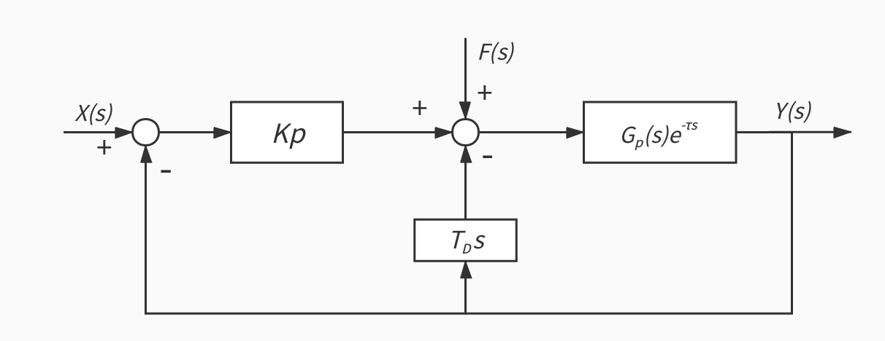

## 1 控制器

### 1.1 预设升温曲线

* 期望温度输入曲线为一次函数曲线

  * 控制时间为40分钟左右，控制温度幅度约为40℃到80℃．

  * 曲线斜率
    $$
    k=\frac{80C-40C}{40\min}=1 C/\min
    $$
    根据后续实验，该斜率值修正为1.1℃/min，后续记该斜率为slope = 1.1℃．
    
  * 截距$b=0$，即在接管控制之后期望温度曲线为正比例函数．

* 控制方式

  * 雷达启动初期，可以利用雷达自热升温．
  * 当雷达自热升温曲线较为平缓后，控制器接管控制．

### 1.2 设置输出

* 通过串口通讯程序(driver)实现控制器与外部硬件(风扇)的通讯．
* 根据已有驱动代码，driver的接口为占空比，应将控制器输出转化为占空比输出．
* 通过继电器对风扇进行通断控制，模拟PWM输出，实现输出功率的控制．

### 1.3 控制对象

* 雷达的温度传感器在雷达内部，外界加热通过热风作用在雷达的金属外壳上，热量传递需要时间，并且系统惯性较大．

* 将该温度控制对象抽象为一个带有大时滞环节的一阶惯性环节，频域表达式：
  $$
  G(s)=G_p(s)\cdot e^{-\tau s}=\frac K{Ts+1}\cdot e^{-\tau s}
  $$
  其中$\tau/T>0.5$.

* 考虑到该对象时域表达式较复杂且各参数与实验环境相关，波动较大，所以不建模，实地测量调参

### 1.4 控制器设计

* 采用位置式PD控制，考虑到对象类型，可以采用中间微分反馈方案

  * 中间微分

    

  * 离散时域表达式：
    $$
    u(k)=K_p\cdot e(k)-K_d \cdot [y (k)-y(k-1)]
    $$

  * 考虑到该系统需要跟踪单位速度曲线，且为了避免数据波动对微分的影响，时域表达式修正为：
    $$
    u(k)=K_p\cdot e(k)-K_d \cdot [(y (k)-y(k-T))\frac{1\min}{T}-target\_slope]
    $$
    或写作：
  $$
  u(k)=K_p\cdot e(k)-K_d \cdot [slope-target\_slope]
  $$

​		其中$target\_slope=1.1$为预设曲线的斜率，T为一个微分时间间隔．

  * 设置控制器工作频率为三秒钟，保证控制较为平滑

### 1.5 参数设置

* 比例部分

  * 经过实际测量，系统处于稳态时，实际温度与期望温度之差保持在±1℃．

  * 当误差为0.5℃时，使控制器的输出为100％
    $$
    max[e(k)]\cdot K_p-0= output
    \\ \Downarrow\\　0.5 \cdot K_P=100\%
    \\　\Downarrow　\\
    K_p=2
    $$

  * 可以得出Kp的值在2左右．

    

* 微分部分

  * 考虑到系统特性，希望微分部分作用效果较强，能够提前预测系统接下来的温度走向．

  * 经过实际测量，控制器开启后的升温曲线斜率与期望斜率之差保持在±1℃/min之内，当升温较为稳定时，斜率之差保持在正负0.5℃/min之内．为了让控制器对温度斜率误差较敏感．令斜率误差为0.5℃/min时（假定比例部分误差为０）控制器输出为50％：
    $$
    0-max[slope-target\_slope]\cdot K_d=output
    \\\Downarrow\\
    0.5\cdot K_d=50\%
    \\\Downarrow\\
    K_d = 1
    $$

  * 可以得出Kd的值在1左右

  * 另外，考虑到系统跟踪速度曲线较为困难，微分部分仅在升温曲线斜率小于期望斜率时开启．
    $$
    output_d=
    \begin{cases}
    (target\_slope－slope)\cdot K_d&,slope<target\_slope
    \\
    0&,slope>=target\_slope
    \end{cases}
    $$

  * 微分周期问题

    * 微分周期应该尽量小，以尽量逼近实际升温曲线斜率

    * 由于温度输入为离散信号，且部分雷达温度传感器精度较低，微分周期应该大于一定值以避免误差

    * 目前暂定微分周期为15s，该数据适用于16线，32线，128线雷达．但由于MEMS和bpearl雷达的传感器温度较低，可将该周期值修正为30-60s
      $$
      T=
      \begin{cases}
      15s&,Lidar-16,32,128
      \\
      30s-60s &,Lidar-mems,bp
      \end{cases}
      $$